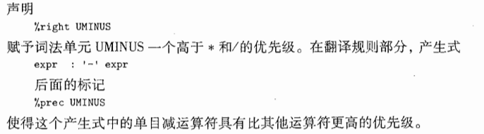

策略: 

1. flex和bison学习

2. 读懂火炬代码

3. merge得到自己的成果

## Flex教程

### lex程序结构

```latex
声明
	//包含变量, 明示常量(标识符/词法单元的名字)
%%	
转换规则
	模式 {动作}
	//动作: 一般C语言编写
%%
辅助函数
	//各个动作使用的辅助函数
```

##### 词法单元的名字


##### 正则定义

转义字符`\`


##### 转换规则

- if: 直接返回IF
- id: installID()
  - 功能: 将词素放入`符号表`, 返回指向表项的指针
  - 实现时可以使用的Lex自动赋值的变量:
    - `yytext`: **指向词素开头**
    - `yyleng`: **刚找到的词素的长度**


### lex执行过程

词法分析器与语法分析器协同工作:

- 语法分析器**调用**词法分析器, 词法分析器读取字符
  - 词法分析器找到**最长的匹配**, 执行**动作A**, 随后A将控制**返回**给语法分析器
- 返回值: 词法单元名
  - 但是可以通过int型变量`yylval`传递附加信息

### lex高级特性

#### yylineno选项

- 功能: 自动维护所读程序的行号

- 使用时需要声明

```
%option yylineno
```

## Bison教程

##### Bison的IO: 


### Bison程序结构

```Python
声明
	%{ C声明 }%
	对词法单元的声明
    	%token INT
        %token ADD SUB MUL DIV
%%

翻译规则
	<左部>:	<右部1>	{<语义动作1>}
		  |	 <右部2>	  {<语义动作2>}
          | ......
          ;
%%

辅助性C语言例程
```

##### 声明


##### 翻译规则

- `$$`表示左部属性, `$i`表示右部第i个文法符号属性

- 运算符用`单引号`括起来


##### 辅助C语言例程

提供`yylex()`进行词法分析, 一般用`flex`生成, 直接include即可:

```c
#include "lex.yy.c"
```

### Bison属性值类型

#### 默认属性值类型

为宏`YYSTYPE`, 默认为`int`

#### 自定义属性值

##### 方法1: 更改`YYSTYPE`

可以在C语言声明中加入

```
#define YYSTYPE float
```

则: 属性值都为`float`

##### 方法2: 定义`YYSTYPE`为`union`


### 位置信息

Bison自带位置信息`YYLTYPE`, 定义如下

```
typedef struct YYLTYPE{
	int first_line;
	int first_col;
	int last_line;
	int last_col;
}
```

但是Bison没有主动维护, 只得自己加一些代码

初始化`yycolumn=1`, 定义`YY_USER_ACTION`


并在发现换行符之后对变量yycolumn进行复位:


### 二义性文法的解决

#### 默认解决方式

- **归约-归约冲突**: 使用`列在前面`的冲突产生式
- **移入-规约冲突**: 总是`移入`

#### (没整明白)自定义解决方式

##### 举例: 四则运算


使得+和-具有相同优先级, 且为左结合

且: 


##### 举例: if-else

在产生式后增加一个标记, 表明本产生式优先级和这个终结符号相同

```
%prec <终结符>
```


举例: 



#### 举例

语法


Bison程序


## 怎么改呢??

### 删掉所有`attribute`, `debug`, `error type`

### 更改print

### 理解/重写AST

## C语言相关知识

### 可变参数(va_arg,va_list,va_start,va_end)

