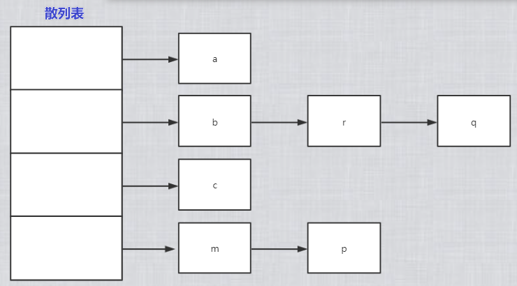
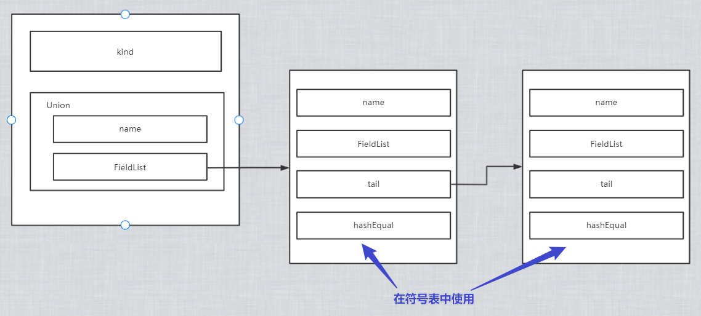

<div align = "center"><span style='font-size:30px;font-family:宋体;'>2022年春季学期</span></div>

<div align = "center"><span style='font-size:30px;font-family:宋体;'>哈尔滨工业大学计算学部</span></div>

<div align = "center"><span style='font-size:30px;font-family:宋体;'>《编译原理》课程</span></div>


<div align = "center"><span style='font-size:32px;font-family:宋体;'>Lab2 语义分析 实验报告</span></div>


<span style='font-size:20px;font-family:宋体;'>目录</span>

[TOC]


| 姓名     | 杨文昊           |
| -------- | ---------------- |
| 学号     | 1190303027       |
| 班号     | 1903202          |
| 电子邮件 | 675451361@qq.com |
| 手机号码 | 15855161066      |

<div STYLE="page-break-after: always;"></div>

## 亮点1: 符号表用散列表实现

用散列表实现, 有效提高存取效率.

### 散列表构建算法

计算散列值, 插入对应位置. 若出现冲突, 则使用`链表`进行连接.



### 散列表接口

```c
void initTable();//初始化2个全局表格
int insertTable(FieldList f);//变量插入变量表
int insertFunc(Functype f,int type);//函数插入函数表
void insertParam(Functype f);//函数参数插入
FieldList findSymbol(char* name);//查找变量
Functype findFunc(char* name);//查找函数
void checkFunc();    //最后检验是否有未定义的函数
```


## 亮点2: 符号表用2个表, 分别存储变量和函数

### 变量存储在varTable, 结构体额外用FieldList_链接

C--中的总的类型信息存储与实验指导中基本⼀致: 

```c
struct Type_
{
	enum { basic, array, structure, constant} kind;
	union
	{
		int basic;// 基本类型
		struct { Type elem; int size; } array;// 数组类型信息包括元素类型与数组大小构成
		Structure structure;// 结构体类型信息是一个链表
	} u;
};
```

结构体信息存储: 

​	与指导书不同在于对于结构体类型的信息, 如下图所示, 在总的信息存储中只存储`name`和`FieldList`, 然后链接一个个结构体单元. 其中`hashEqual`在符号表中使用, 负责连接.



- 结构体基本定义:

```c
struct Structure_
{
	char *name;          //结构体的名字
	FieldList strfield;    //结构体的域
};
```

- 结构体的域定义: 

```c
struct FieldList_
{
	char* name;	         // 域的名字
	Type type;	         // 域的类型
	FieldList tail;	     // 下一个域
	FieldList hashEqual;  //”name“的哈希值相同的构成一个链表
};
```

### 函数存储在funcTable, 参数也用FieldList_链接

函数信息存储, 原理与结构体类似

```c
struct Functype_
{
	char*name;           //函数的名字
	bool isDefined;      //是否已经被定义
	int row;             //位置信息
	Type ret_type;         //返回值类型
	FieldList param;     //参数链表
	Functype hashEqual;   //”name“的哈希值相同的构成一个链表
};
```


## 亮点3: 完成选做1和选做3

### 函数除定义外可以声明

函数`insertFunc(Functype f,int type)` 

- `功能`: 在函数符号表中插⼊新的函数

- `参数`: type
  - type=0 表示插入的函数为函数声明， 
  - type=1 表示插入的函数为函数定义。
- `返回值`: 有三种情况
  - 返回值为0 表示没有错误，
  - 返回值为1 表示检测到函数已经被定义过，
  - 返回值为2 表示检测到函数声明之间不⼀致。

实现:

- 在文法中给予声明和定义不同的动作
- 令`type`等于`0`或`1`调用`insertFunc()`

### 结构等价

函数`paramEqual(FieldList f1,FieldList f2) `

- `功能`: 比较两个函数的参数是否⼀致或者判断两个结构体之间是否结构等价
- `实现`: 对链表逐项比较


## 编译与运行

- 编译: 在代码目录, 命令行输入`make`即可
- 运行: 编译完成后, 命令行输入`./parser xxx.cmm`即可

