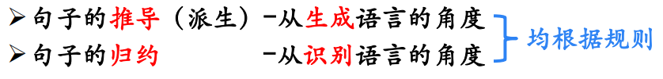

# 绪论

## 语言处理系统

`编译器`属于`编译系统`, 与`预处理器`, `汇编器`, `链接器`一起构成整个`语言处理系统`

### 预处理器

**C预处理器干了什么?**

`C 预处理器`不是编译器的组成部分，但是它是编译过程中一个单独的步骤。简言之，C 预处理器只不过是一个文本替换工具而已，它们会指示编译器在实际编译之前完成所需的预处理。我们将把 C 预处理器（C Preprocessor）简写为 `CPP`。


#### 预处理器实例

- #include

```c
#include <stdio.h>
#include "myheader.h"
```

这些指令告诉 CPP 从**系统库**中获取 stdio.h，并添加文本到当前的源文件中。下一行告诉 CPP 从本地目录中获取 **myheader.h**，并添加内容到当前的源文件中。

- #define

```c
#define MAX_ARRAY_LENGTH 20
```

这个指令告诉 CPP 把所有的 MAX_ARRAY_LENGTH 替换为 20。使用 *#define* 定义常量来增强可读性。

- #undef

```cpp
#undef  FILE_SIZE
#define FILE_SIZE 42
```

这个指令告诉 CPP 取消已定义的 FILE_SIZE，并定义它为 42。

- #ifdef

```cpp
#ifndef MESSAGE
   #define MESSAGE "You wish!"
#endif
```

这个指令告诉 CPP 只有当 MESSAGE 未定义时，才定义 MESSAGE。

```c++
#ifdef DEBUG
   /* Your debugging statements here */
#endif
```

这个指令告诉 CPP 如果定义了 DEBUG，则执行处理语句。在编译时，如果您向 gcc 编译器传递了 *-DEBUG* 开关量，这个指令就非常有用。它定义了 DEBUG，您可以在编译期间随时开启或关闭调试。

### 编译器Input和Output

input: C语言等高级语言

process: 编译

output: 汇编语言

### 链接器

**链接器干了什么?**


## 编译器结构/阶段`Phrase`

### 人工自然语言翻译

经过分析, 获得语义, 再进行生成


分析的阶段: 

`词法`-`语法`-`语义`


### 编译器结构

`前端/分析(源语言)` -- `中间表示` -- `后端/综合(目标语言)`


### 词法分析

#### Input & Output

input: 字符串

output: token序列

#### Output: token序列中token的设计


#### 词法分析举例


### 语法分析

#### Input & Output

input: token序列

output: 短语的语法分析树

#### 语法分析举例

可以用上下文无关文法写出


### 语义分析

#### Input & Output

Input: 语法分析树

Output: `符号表` + `语义检查结果`

#### Output1: 符号表

符号表的内容: 标识符的属性信息


- KIND: 简单变量, 复合变量(数组, 记录...), 过程(函数)

- TYPE: 整型, 实数, 布尔, 指针, 字符...

- ADDR: 存储位置, 长度: 相对地址

  

- VAL:值
- 作用域
- 参数, 返回值

#### Output2: 语义检查


### 中间代码生成

**中间代码可以理解为真正的语义**

#### Input & Output

Input: 语法树

Output: 三地址码

个人认为最难的一步: 从语法分析树到三地址码


#### Output: **三地址码**

三地址码由类似于汇编语言的指令序列组成， **每个指令最多有三个操作数**


##### 四元组形式的三地址码


### 目标代码生成

#### Input & Output

Input: 中间代码

Output: 目标语言

`关键`: 为程序中使用的变量**合理分配寄存器**

### 代码优化

为改进代码所进行的等价程序变换，使其运行得更快一些、占用空间更少一些，或者二者兼顾

# 语言与文法

本节内容已经在<u>形式语言与自动机</u>中学习, 简略给一下知识点

文法


符号约定


规约与派生



举例: 标识符的文法


文法的分类


CFG分析树

- 短语

- 直接短语

二义性文法

- 加上消歧规则

# 词法分析

## 数学理论: 正则语言

### 正则表达式RE

### 正则定义

将正则表达式当做`终结符`一样使用

**举例**: 表示指数形式的,整型/浮点的,无符号数


### 有穷状态自动机FA

最长前缀匹配原则: 

- 可能符合多种模式, 选择最长前缀匹配

DFA与NFA

DFA更容易计算机实现


### 从正则表达式到NFA再到DFA

步骤: 

正则表达式 --> NFA --> DFA

第一步: 从正则表达式到NFA


第二步: 从NFA到DFA-子集构造法


## 应用: 词法分析


# 语法分析

## 自顶向下分析

自顶向下推导方式:

- 最左推导
- 最右推导

最左推导相关概念:

- `最左句型`: 推导结果/中间件
- 最左/最右推导的`唯一性`: 

举例: 文法+输入

自顶向下分析的通用形式:

```Python
void A( ) {
    1) 选择一个A产生式， A →X1 X2 … Xk ；
    2) for ( i = 1 to k ) {
        3) if ( Xi是一个非终结符号)
        4) 调用过程 Xi ( ) ; 
        5) else if ( Xi 等于当前的输入符号a) 
        6) 读入下一个输入符号;
        7) else /* 发生了一个错误 */ ;
	}
}
```

回溯现象

预测分析法

递归

非递归

