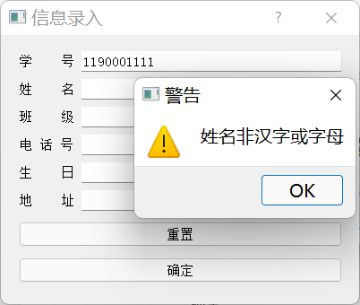

<div align = "center"><span style='font-size:30px;font-family:宋体;'>2022年春季学期</span></div>

<div align = "center"><span style='font-size:30px;font-family:宋体;'>哈尔滨工业大学计算学部</span></div>


<div align = "center"><span style='font-size:40px;font-family:宋体;'>《数据库》课程</span></div>


<div align = "center"><span style='font-size:40px;font-family:宋体;'>Lab2 实验报告</span></div>


| 姓名     | 杨文昊           |
| -------- | ---------------- |
| 学号     | 1190303027       |
| 班号     | 1903202          |
| 电子邮件 | 675451361@qq.com |
| 手机号码 | 15855161066      |

<div STYLE="page-break-after: always;"></div>
<span style='font-size:20px;font-family:宋体;'>目录</span>

[TOC]

## 实验目的

在熟练掌握MySQL基本命令、SQL语言以及用C语言编写MySQL操作程序的基础上，学习简单数据库系统的设计方法，包括数据库概要设计、逻辑设计。

## 实验环境与技术选型

- 联想拯救者R7000, Windows 11

- 数据库: MySQL 8
- 界面: Qt Creator 4
- 代码: Python 3.9

## 实验要求

开发一个数据库系统，可以参考教材的例子。

- 该系统的E-R图至少包括8个实体和7个联系（必须有一对一联系、一对多联系、多对一联系）。

- 在设计的关系中需要体现关系完整性约束：主键约束、外键约束，空值约束。

- 对几个常用的查询创建视图、并且在数据库中为常用的属性（非主键）建立索引。

- 该系统功能必须包括：插入、删除、连接查询、嵌套查询、分组查询。其中插入，删除操作需体现关系表的完整性约束，例如插入空值、重复值时需给予提示或警告等。

- 加分项：界面友好、包含事务管理、触发器等功能。

## ER图与关系数据库模式

 一个简易的教务管理系统

### ER图


### 关系数据库模式


### 关系完整性约束

#### 主键约束

以`学生荣誉表`为例: 第`5`行声明主键

```sql
CREATE TABLE `studenthonor` (
  `S#` char(10) NOT NULL,
  `SH#` int NOT NULL AUTO_INCREMENT,
  `SHNAME` char(20) NOT NULL,
  PRIMARY KEY (`SH#`),
  KEY `S#` (`S#`),
  CONSTRAINT `studenthonor_ibfk_1` FOREIGN KEY (`S#`) REFERENCES `student` (`S#`) ON DELETE CASCADE
) 
```

#### 外键约束

以`班级表`为例: 第`7`行声明外键约束

```sql
CREATE TABLE `class` (
  `C#` char(7) NOT NULL,
  `D#` char(3) NOT NULL,
  `Cnum` int DEFAULT '0',
  PRIMARY KEY (`C#`),
  KEY `D#` (`D#`),
  CONSTRAINT `class_ibfk_1` FOREIGN KEY (`D#`) REFERENCES `department` (`D#`)
)
```

以`选课表`为例: 第`7,8`行声明外键约束, 而且当被引用的元素被删除时, 含有该元素作为外键的元组也被删除. 此处选课这个关系，当有学生退学，那么该学生选的课的信息也全部删除

```sql
CREATE TABLE `chooseclass` (
  `CR#` char(3) NOT NULL,
  `S#` char(10) NOT NULL,
  `Grade` int DEFAULT NULL,
  PRIMARY KEY (`CR#`,`S#`),
  KEY `S#` (`S#`),
  CONSTRAINT `chooseclass_ibfk_1` FOREIGN KEY (`CR#`) REFERENCES `course` (`CR#`),
  CONSTRAINT `chooseclass_ibfk_2` FOREIGN KEY (`S#`) REFERENCES `student` (`S#`) ON DELETE CASCADE
) 
```

#### 空值约束

以`课程表`为例: 课程名不应当为空, 在第`3`行把`CRNAME`设置为`NOT NULL`

```sql
CREATE TABLE `course` (
  `CR#` char(3) NOT NULL,
  `CRNAME` char(20) NOT NULL,
  `T#` char(10) NOT NULL,
  `credit` float DEFAULT '0',
  `remain` int NOT NULL,
  PRIMARY KEY (`CR#`),
  UNIQUE KEY `CRNAME` (`CRNAME`),
  KEY `T#` (`T#`),
  CONSTRAINT `course_ibfk_1` FOREIGN KEY (`T#`) REFERENCES `teacher` (`T#`)
)
```

### 视图

为常用到的查询创建视图: 包括`学生-课程视图`, `教师-课程视图`, `学生-荣誉视图`

- 学生-课程视图


​	视图属性如下:


​	创建语句:

```sql
CREATE ALGORITHM=UNDEFINED DEFINER=`root`@`localhost` SQL SECURITY DEFINER VIEW `sqllab2`.`view_student_course` AS 
select  `sqllab2`.`student`.`S#` AS `S#`,  `sqllab2`.`student`.`SNAME` AS `SNAME`,  `sqllab2`.`student`.`C#` AS `C#`,  `sqllab2`.`course`.`CRNAME` AS `CRNAME`,  `sqllab2`.`teacher`.`TNAME` AS `TNAME`,  `sqllab2`.`department`.`DNAME` AS `DNAME`,  `sqllab2`.`course`.`credit` AS `credit` from ((((`sqllab2`.`student`  join `sqllab2`.`chooseclass`)  join `sqllab2`.`course`)  join `sqllab2`.`teacher`)  join `sqllab2`.`department`) where ((`sqllab2`.`student`.`S#` = `sqllab2`.`chooseclass`.`S#`)  and (`sqllab2`.`chooseclass`.`CR#` = `sqllab2`.`course`.`CR#`)  and (`sqllab2`.`course`.`T#` = `sqllab2`.`teacher`.`T#`)  and (`sqllab2`.`teacher`.`D#` = `sqllab2`.`department`.`D#`))
```

- 教师-课程视图


- 学生-荣誉视图


### 索引

以`学院表`为例: 见第`6`行, 用`学院名`作为索引

```sql
CREATE TABLE `department` (
  `D#` char(3) NOT NULL,
  `DNAME` char(10) NOT NULL,
  `Dnum` int DEFAULT '0',
  PRIMARY KEY (`D#`),
  UNIQUE KEY `index_department_DNAME` (`DNAME`)
)
```

以`班级表`为例: 见第`6`行, 用`学院号`作为索引

```sql
CREATE TABLE `class` (
  `C#` char(7) NOT NULL,
  `D#` char(3) NOT NULL,
  `Cnum` int DEFAULT '0',
  PRIMARY KEY (`C#`),
  KEY `D#` (`D#`),
  CONSTRAINT `class_ibfk_1` FOREIGN KEY (`D#`) REFERENCES `department` (`D#`)
) 
```

`课程表`亦然, 用`课程名`作为索引(见4.3.3)

## 必做功能

插入、删除、连接查询、嵌套查询、分组查询。其中插入，删除操作需体现关系表的完整性约束，例如插入空值、重复值时需给予提示或警告等。

### 查询

#### 连接查询

**`学生获奖情况`查询:** 

需要输出学号、姓名、班级、奖项名称和院系名称，院系名称在院系的表中，奖项名称在奖项的表中，学生姓名、学号、班号在学生的表中，因此我们需要将三张表连接进行查询。 

```sql
select
student.`S#`,student.SNAME,student.`C#`,studenthonor.SHNAME,department.DNAME
from student,studenthonor,class,department
where student.`S#`=studenthonor.`S#` and student.`C#`=class.`C#` and
class.`D#`=department.`D#`;
```


如上过程实际在`student_award视图`创建中已经完成.

#### 嵌套查询

**查询指定院系所开设的每一门课程的选课人数:**

- 我们先使用选课表和课程表、课程表和教室表、教师表和院系表进行查询，得知该院系开设课程的选课人数
- 然后利用院系名称的约束，最终输出

```sql
select DNAME,CRNAME,TNAME,
(select count(*) from chooseclass where chooseclass.`CR#`=course.`CR#` and
course.`T#`=teacher.`T#` and teacher.`D#`=department.`D#`) as count
from course,department,teacher
where course.`T#`=teacher.`T#` and teacher.`D#`=department.`D#` and
department.DNAME=dname;
```


#### 分组查询

**查询每个学生选课的总学分:**

- 将全部的选课记录按照学号进行分组
- 然后统计学分，计算求和值

```sql
select `S#`,SNAME,`C#`,sum(credit) from view_student_course group by `S#`;
```


### 插入

**学生信息录入:**

```sql
insert into student values(sno,sname,cno,tel,birth,addr);
```


插入空值、重复值时需给予提示或警告等。

#### 插入空值警告

输入时先用`正则表达式`进行检查即可

**当学号填写为空时:**


**当姓名填写为空时**



#### 插入重复警告

在数据库中先进行查询即可

**当学号重复**


#### 插入外键检查

在数据库中先进行查询即可

**当班级不存在**


### 删除

**当学生办理退学**

```sql
delete from student where `S#`= sno and SNAME= sname and `C#`= cno;
```


#### 删除不存在警告

**当不存在此学生**


**当姓名或班号信息不正确**


## 加分项

### 界面友好

使用`Qt`构造`UI`, 界面友好


### 事务

**以选课为例: 当选课时**

- step1: 更改`course`表中`remain`(课程剩余容量)减一
- step2: 将选课信息插入到`chooseclass`表

```sql
START TRANSACTION;
-- step1: 更改`course`表中`remain`(课程剩余容量)减一
UPDATE course SET remain = remain - 1 WHERE `CR#` = crno;
-- step2: 将选课信息插入到`chooseclass`表
INSERT INTO chooseclass VALUES (crno,sno);
COMMIT;
```

### 触发器

**触发器实现类型检查: 当选课时, 需要先检查是否还有课程容量**

- 在更新`course表`之前, 需要先检查是否还有课程容量
- 若剩余课程容量为0, 则报`sqlstate_value`为`HY000`的错误，从而使得添加失败

```sql
DELIMITER //

CREATE TRIGGER course_remain_check_trigger
BEFORE UPDATE ON course
FOR EACH ROW
BEGIN
	DECLARE course_remain INT;
	
	SELECT remain INTO course_remain FROM course 
	WHERE `CR#` = NEW.`CR#`;
	
	-- 若剩余课程容量为0, 则报sqlstate_value为'HY000'的错误，从而使得添加失败
	IF course_remain <= 0
		THEN SIGNAL SQLSTATE 'HY000' SET MESSAGE_TEXT = '课程已无容量';
	END IF;

END //

DELIMITER ;
```

### 日志与备份

**触发器实现日志与备份功能: 当学生退学时, 同步保留原有信息到`student_log_back表`中**

```sql
DELIMITER //

CREATE TRIGGER dropout_log_trigger
BEFORE DELETE ON student
FOR EACH ROW
BEGIN
	INSERT INTO student_log_back(`S#`,`SNAME`,`C#`,`tel`,`Birth`,`addr`,`delete_time)
	VALUES(OLD.`S#`,OLD.`SNAME`,OLD.`C#`,OLD.`tel`,OLD.`Birth`,OLD.`addr`,NOW());
END //

DELIMITER ;
```


