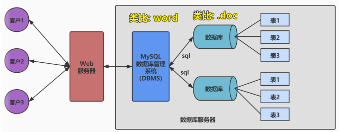

# 数据库概述

### 为什么使用数据库

目的: 数据持久化

相比较与`文件`存储, `数据库`存储的优势:

- 数据的多样性
- 数据的条目数

### 数据库相关

**DB: 数据库DataBase**

即存储数据的“仓库”，其本质是一个文件系统。它保存了一系列有组织的数据。

**DBMS: 数据库管理系统（Database Management System）**

是一种操纵和管理数据库的大型软件，用于建立、使用和维护数据库，对数据库进行统一管理和控 制。用户通过数据库管理系统访问数据库中表内的数据。

eg: MySQL实际上是数据库管理软件

**SQL：结构化查询语言（Structured Query Language）**

专门用来与数据库通信的语言。

### 关系型数据库与非关系型数据库

