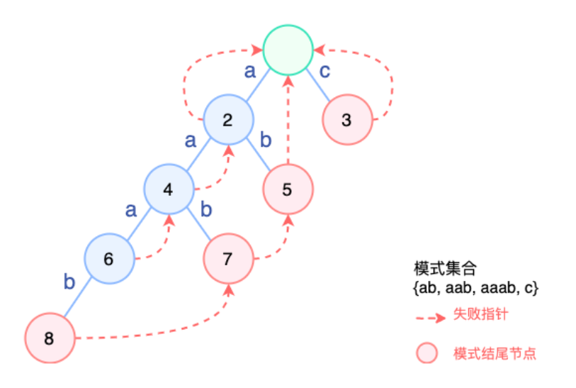
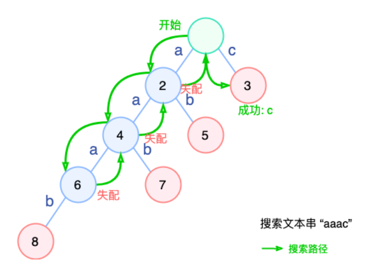
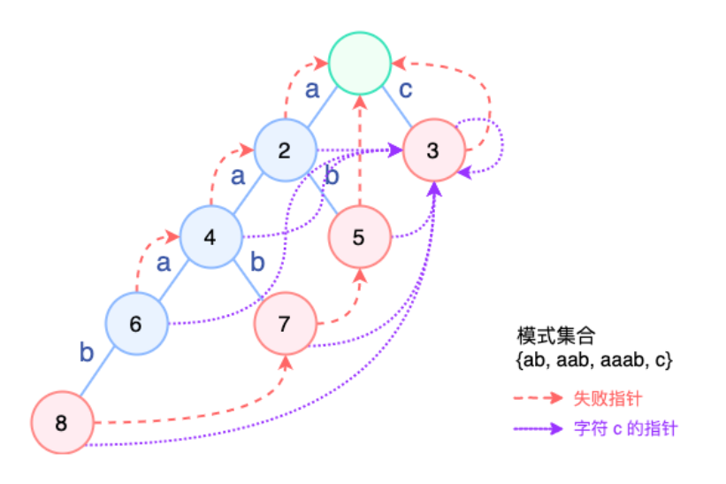

<div align = "center"><span style='font-size:30px;font-family:宋体;'>2022年春季学期</span></div>

<div align = "center"><span style='font-size:30px;font-family:宋体;'>哈尔滨工业大学计算学部</span></div>

<div align = "center"><span style='font-size:30px;font-family:宋体;'>《信息内容安全》课程</span></div>


<div align = "center"><span style='font-size:32px;font-family:宋体;'>对AC算法的改进</span></div>


<span style='font-size:20px;font-family:宋体;'>目录</span>

[TOC]


| 姓名 | 杨文昊     |
| ---- | ---------- |
| 学号 | 1190303027 |
| 班号 | 1903202    |

<div STYLE="page-break-after: always;"></div>

## 概述与实验结果

对`AC自动机算法`中`fail()`进行改进, 并用`Java`语言进行实现

实验环境:

- 拯救者R7000笔记本
- Java13

实验结果如下:

|                | 用例1  | 用例2  | 用例3  | 用例4  |
| -------------- | ------ | ------ | ------ | ------ |
| 改进前运行时间 | 3504   | 5471   | 11748  | 18849  |
| 改进后运行时间 | 3471   | 5354   | 11672  | 18703  |
| 提升比例       | 0.0094 | 0.0213 | 0.0065 | 0.0077 |

实验表明: 对于常见语义材料, 有着1%左右的提升


## 对fail()的改进思路

具体做法是，在构建失败指针时，对于遍历到的每一个节点：

**若它不包含某个字符 `x`，那么将它失败节点字符 `x` 所指向的那个节点作为自己的孩子。** 这隐含了一个情况：如果失败节点不存在或者同样不包含 `x`，那么这个位置的指针不会改变。


举例:

某些时候，查找过程中需要连续多次跳转 fail 指针，例如模式集合 { ab, aab, aaab, c }，目前的 AC 结构如下：



搜索文本串 “aaac” 时，路径如下：



可以看到，为了搜索潜在的模式串 `aaab` 我们一直搜索到 `6` 号节点，然后一步步失败，直到根节点，然后才重新匹配到了 `c`，要是可以一步到位就好了。


最终得到的fail():




## Java代码实现

```Java
import org.jetbrains.annotations.NotNull;
import org.jetbrains.annotations.Nullable;

import java.nio.charset.StandardCharsets;
import java.util.ArrayDeque;
import java.util.ArrayList;
import java.util.Arrays;
import java.util.List;

public class AcAuto {

    private static final int BYTE_SIZE = Byte.MAX_VALUE - Byte.MIN_VALUE + 1;

    private final AcNode root = new AcNode();
    private final ArrayList<AcNode> nodes = new ArrayList<>();
    private int[] fail;

    public AcAuto() {
        nodes.add(root);
    }

    /**
     * 求失败指针时 bfs 用
     */
    private final ArrayDeque<Integer> q = new ArrayDeque<>();

    private static class AcNode {
        /**
         * 模式串。<code>null</code> 表示此节点不是模式串的结尾。
         */
        @Nullable
        String pattern = null;
        /**
         * 子节点在 {@link #nodes} 的下标。<code>-1</code> 表示相应 Byte 没有子节点。children 下标即代表 Byte 数据。
         */
        int[] children = new int[BYTE_SIZE];

        AcNode() {
            Arrays.fill(children, -1);
        }
    }

    public void build(List<String> words)
    {
        for (String word : words)
        {
            insert(word);
        }

        calcFail();
//        calcFail_improved();
    }

    public void build_improved(List<String> words)
    {
        for (String word : words)
        {
            insert(word);
        }

//        calcFail();
        calcFail_improved();
    }

    /**
     * 插入一个模式串。模式串改变后需要调用 {@link #calcFail()} 重新计算失败指针。
     *
     * @param key 要匹配的模式串。
     */
    void insert(@NotNull String key) {
        AcNode p = root;
        byte[] bytes = key.getBytes(StandardCharsets.UTF_8);
        for (byte b : bytes) {
            int i = b - Byte.MIN_VALUE;
            if (p.children[i] == -1) {
                // 不包含所需节点，创建
                AcNode newNode = new AcNode();
                nodes.add(newNode);
                p.children[i] = nodes.size() - 1;
            }
            p = nodes.get(p.children[i]);
        }
        p.pattern = key;
    }

    void calcFail() {
        q.clear();
        fail = new int[nodes.size()];
        Arrays.fill(fail, -1);
        q.addLast(0);
        while (!q.isEmpty()) {
            int fatherIndex = q.pop();
            AcNode father = nodes.get(fatherIndex);
            for (int i = 0; i < father.children.length; i++) {
                if (father.children[i] == -1) {
                    continue;
                }
                int currIndex = father.children[i];
                int temp = fail[fatherIndex]; // temp 为当前节点 curr 父节点的失败指针
                while (temp != -1 && nodes.get(temp).children[i] == -1) {
                    // 若父亲的失败节点不为空，但是不存在公共后缀，则继续向上从这个节点的失败节点寻找
                    temp = fail[temp];
                }
                if (temp == -1) {
                    fail[currIndex] = 0;
                } else {
                    // 父亲的失败节点存在公共后缀，则将公共后缀的节点作为 curr 的失败节点
                    fail[currIndex] = nodes.get(temp).children[i];
                }
                q.addLast(currIndex);
            }
        }
        fail[0] = 0;
    }

    void calcFail_improved() {
        q.clear();
        fail = new int[nodes.size()];
        Arrays.fill(fail, -1);
        q.addLast(0);
        while (!q.isEmpty()) {
            int fatherIndex = q.pop();
            AcNode father = nodes.get(fatherIndex);
            for (int i = 0; i < father.children.length; i++) {
                if (father.children[i] == -1) {
                    // ！！！！修改这里！！！！
                    father.children[i] = nodes.get(Math.max(fail[fatherIndex], 0)).children[i];
                    continue;
                }
                int currIndex = father.children[i];
                int temp = fail[fatherIndex]; // temp 为当前节点 curr 父节点的失败指针
                while (temp != -1 && nodes.get(temp).children[i] == -1) {
                    // 若父亲的失败节点不为空，但是不存在公共后缀，则继续向上从这个节点的失败节点寻找
                    temp = fail[temp];
                }
                if (temp == -1) {
                    fail[currIndex] = 0;
                } else {
                    // 父亲的失败节点存在公共后缀，则将公共后缀的节点作为 curr 的失败节点
                    fail[currIndex] = nodes.get(temp).children[i];
                }
                q.addLast(currIndex);
            }
        }
        fail[0] = 0;
    }

    @FunctionalInterface
    interface MatchCallback {
        void onMatch(@NotNull String key);
    }

    void match(@Nullable String str) {
        if (str == null) {
            return;
        }
        byte[] bytes = str.getBytes(StandardCharsets.UTF_8);
        int pIndex = 0;
        int i = 0;
        while (i < bytes.length) {
            int b = bytes[i] - Byte.MIN_VALUE;
            if (nodes.get(pIndex).children[b] != -1) {
                // 当前节点包含所需的字符
                pIndex = nodes.get(pIndex).children[b];
                AcNode p = nodes.get(pIndex);
                if (p.pattern != null) {
                    // 正好是一个模式串的结尾，匹配成功
                    System.out.println(p.pattern);
                    // 下一轮从根开始匹配。因为要求每个字符只能被消耗一次（依需求而定）
                    pIndex = 0;
                }
                i++;
                continue;
            }
            // 失配
            if (pIndex == 0) {
                // 只有根节点就失败时，才代表当前字符完全无法匹配，继续下一个字符
                // 否则应该从失败指针处再次查找当前字符
                i++;
            }
            pIndex = fail[pIndex];
        }
    }
}
```

