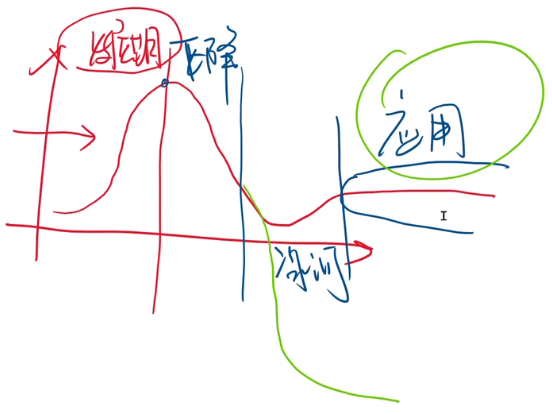
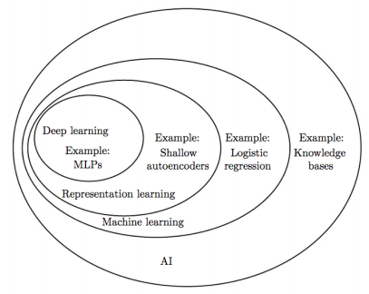
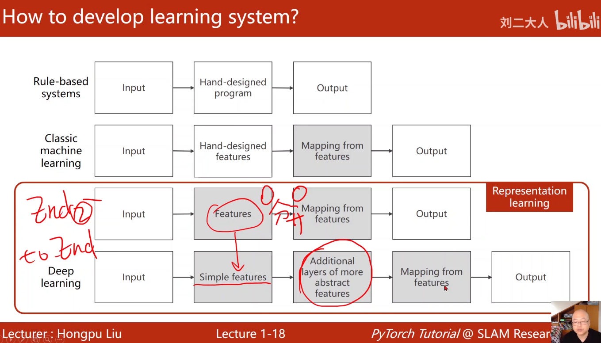
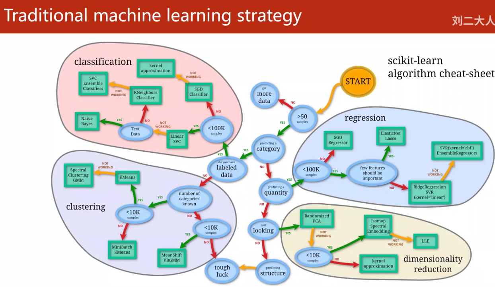
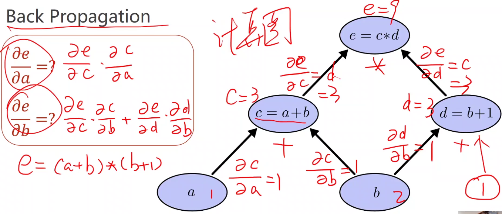
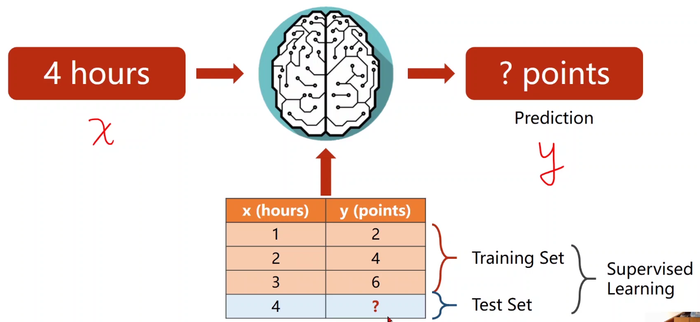
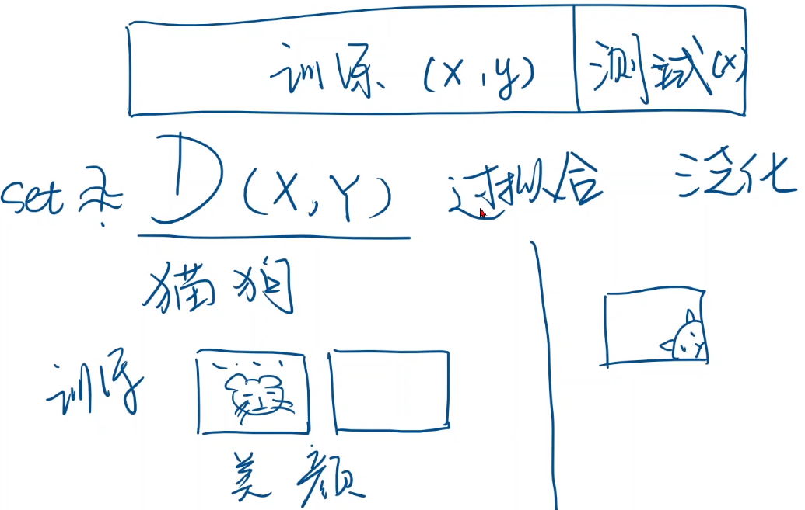
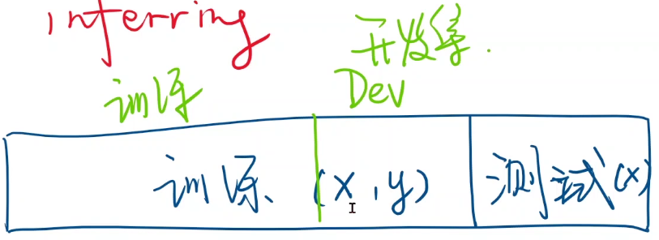

[B站视频链接](https://www.bilibili.com/video/BV1Y7411d7Ys)

课件下载链接：https://pan.baidu.com/s/1vZ27gKp8Pl-qICn_p2PaSw 
提取码：cxe4

# Overview

## 关于这门课

**如何学习深度神经网络?**

- 类似`组装`

### Pytorch版本

教学的Pytorch版本: 0.4

截止2022.1.24的Pytorch版本: 1.10

- 要求: 学会看文档

- 技术发展过程



### 教学目标

用Pytorch完成学习系统

理解神经网络和深度学习

### 算法比较: 传统算法与机器学习算法

传统算法

- 穷举
- 贪心
- 分治
- 动态规划

机器学习算法

- 从Data中找出算法




## 人工智能历史

### 学习系统的设计



机器学习中的维度诅咒

- 内容: feature越多, 需要的样本数越多: a^n

- 解决: 降维

表示学习Present: 

- 高维空间在低维空间的流形(Manifold), 学习器--分开学习

深度学习: 

- 端到端

### 传统机器学习策略及其缺点

- 限制于人工选择的特征

- svm不能很好地处理big数据集

- 越来越多的应用程序需要处理非结构化数据



## 神经网络历史

神经科学 -> 数学, 工程学

一个对人工智能影响深远的生物学实验

- 分层处理视觉信息
- 浅层 - 线条/颜色
- 深层 - 高级特征(猫/狗...)


Back Propagation

原理: 链式法则



如何学习深度神经网络?

- 类似`组装`

# 线性模型

ML步骤:

- DataSet
- Model
- Training

- Inferring



## DataSet

真实集和训练集差异

例如: 猫狗训练集



策略: 划分出dev set



## Model Design

随机猜测w


思路: 让平均损失降到最低


概念: 平均平方误差(mean square error MSE)


思路: 穷举法-采样

## Training

**实时可视化+日志输出+断点重开**

工具: visdom


```python
import numpy as np
import matplotlib.pyplot as plt
#%%
x_data = [1.0,2.0,3.0]
y_data = [2.02,3.98,6.01]
#%%
def forward(x):
    return x*w
#%%
def loss(x,y):
    y_pred = forward(x)
    return (y_pred - y) * (y_pred - y)
#%%
w_list = []
mse_list = []
for w in np.arange(0.0,4.1,0.1):
    print("w = ",w)
    l_sum = 0
    for x_val,y_val in zip(x_data,y_data):
        y_pred_val = forward(x_val)
        loss_val = loss(x_val,y_val)
        l_sum += loss_val
        print('\t',x_val,y_val,y_pred_val,loss_val)
    print("MSE = ",l_sum/3)
    w_list.append(w)
    mse_list.append(l_sum/3)
```

# 梯度下降算法

## 思想

穷举的不可行, 指数级增加


采用分治? 不可以

- Loss并不是凸函数
- w超大时, 计算量仍旧很大


**本质**: 优化问题

**思想**: 贪心

**方法分析:**

- 情况: 非凸函数

- 理论上的缺陷: 得到在局部区域最优的结果/局部最优

  

- 实际情况: 很难陷入局部最优点

- 实际情况: 可能到"鞍点"

  

**计算方法:**

​	

**代码实现:**

**绘图:**

- 指数加权均值

  

- 训练失败的一种情况: 可能是学习率过高

  

## 随机梯度下降

原因: 

- 一个样本的随机性, 很可能跳过`鞍点`


算法区别:

- `SGD`: 使用一个样本的Loss计算偏导数
- `GD`:使用全部样本的Cost计算偏导数


缺点: 

- SGD计算函数值不能并行, w是有依赖


- 折中: batch


