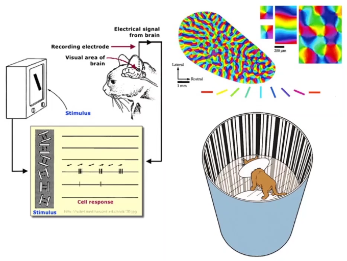

作者: [YangWenhao3906](https://github.com/YangWenhao3906)

[B站视频链接](https://www.bilibili.com/video/BV1Y7411d7Ys)

课件下载链接：https://pan.baidu.com/s/1vZ27gKp8Pl-qICn_p2PaSw 
提取码：cxe4

# Lec1 Overview

## 关于这门课

**如何学习深度神经网络?**

- 类似`组装`

### Pytorch版本

教学的Pytorch版本: 0.4

截止2022.1.24的Pytorch版本: 1.10

- 要求: 学会看文档

- 技术发展过程


### 教学目标

用Pytorch完成学习系统

理解神经网络和深度学习

### 算法比较: 传统算法与机器学习算法

传统算法

- 穷举
- 贪心
- 分治
- 动态规划

机器学习算法

- 从Data中找出算法


## 人工智能历史

### 学习系统的设计


机器学习中的维度诅咒

- 内容: feature越多, 需要的样本数越多: a^n

- 解决: 降维

表示学习Present: 

- 高维空间在低维空间的流形(Manifold), 学习器--分开学习

深度学习: 

- 端到端

### 传统机器学习策略及其缺点

- 限制于人工选择的特征

- svm不能很好地处理big数据集

- 越来越多的应用程序需要处理非结构化数据


## 神经网络历史

神经科学 -> 数学, 工程学

一个对人工智能影响深远的生物学实验

- 分层处理视觉信息
- 浅层 - 线条/颜色
- 深层 - 高级特征(猫/狗...)



Back Propagation

原理: 链式法则


如何学习深度神经网络?

- 类似`组装`

# Lec2 线性模型

ML步骤:

- DataSet
- Model
- Training

- Inferring


## DataSet

真实集和训练集差异

例如: 猫狗训练集


策略: 划分出dev set


## Model Design

随机猜测w


思路: 让平均损失降到最低


概念: 平均平方误差(mean square error MSE)


思路: 穷举法-采样

## Training

**实时可视化+日志输出+断点重开**

工具: visdom


```python
import numpy as np
import matplotlib.pyplot as plt
#%%
x_data = [1.0,2.0,3.0]
y_data = [2.02,3.98,6.01]
#%%
def forward(x):
    return x*w
#%%
def loss(x,y):
    y_pred = forward(x)
    return (y_pred - y) * (y_pred - y)
#%%
w_list = []
mse_list = []
for w in np.arange(0.0,4.1,0.1):
    print("w = ",w)
    l_sum = 0
    for x_val,y_val in zip(x_data,y_data):
        y_pred_val = forward(x_val)
        loss_val = loss(x_val,y_val)
        l_sum += loss_val
        print('\t',x_val,y_val,y_pred_val,loss_val)
    print("MSE = ",l_sum/3)
    w_list.append(w)
    mse_list.append(l_sum/3)
```

# Lec3 梯度下降算法

## 梯度下降算法思想

穷举的不可行, 指数级增加


采用分治? 不可以

- Loss并不是凸函数
- w超大时, 计算量仍旧很大


**本质**: 优化问题

**思想**: 贪心

**方法分析:**

- 情况: 非凸函数

- 理论上的缺陷: 得到在局部区域最优的结果/局部最优

  

- 实际情况: 很难陷入局部最优点

- 实际情况: 可能到"鞍点"

  

**计算方法:**


**代码实现:**

**绘图:**

- 指数加权均值

  

- 训练失败的一种情况: 可能是学习率过高

  

## 随机梯度下降

原因: 

- 一个样本的随机性, 很可能跳过`鞍点`


算法区别:

- `SGD`: 使用一个样本的Loss计算偏导数
- `GD`:使用全部样本的Cost计算偏导数


代码实现:


缺点: 

- SGD计算函数值不能并行, w是有依赖


- 折中: batch


# Lec4 反向传播

## 反向传播算法

计算图的建立

关于计算[Matrix cook book](https://www.math.uwaterloo.ca/~hwolkowi/matrixcookbook.pdf)


链式求导法则


反向传播

原子级别


## PyTorch的Tensor与动态图

### PyTorch中的Tensor:

组成: 包含`data`和`grad`


作为Tensor对象: 

- 若参与运算, 直接构建动态运算图

使用数据: 

- `Tensor.data`, `Tensor.grad`

`*`的重载: Tensor与Tensor之间的数乘

### PyTorch动态图

为当初PyTorch的特色+核心竞争力

计算图构建


backward:

将所有需要梯度的地方求出来并存储在Tensor中, 随即释放计算图

获得梯度: 

`Tensor.grad`仍旧是一个Tensor, 需要取`Tensor.grad.data`

```Python
import torch

x_data = [1.0, 2.0, 3.0]
y_data = [1.98, 4.12, 5.95]
w1 = torch.tensor([1.0], requires_grad=True)
w2 = torch.tensor([1.0], requires_grad=True)
b = torch.tensor([1.0], requires_grad=True)
#%%
def forward(x):
    return w1*x*x + w2*x + b

def loss(x,y):
    y_pred = forward(x)
    return (y_pred-y) ** 2
#%%
print("Before Training: ",5,forward(5))
for epoch in range(100):
    for x,y in zip(x_data,y_data):
        l = loss(x,y)
        # backward: 将所有需要梯度的地方求出来并存储在Tensor中, 随即释放计算图
        l.backward()
        # Tensor.item(): 产生标量
        print("\tw1:",x,y,w1.item(),w1.grad.item())
        print("\tw2:",x,y,w2.item(),w2.grad.item())
        print("\tb:",x,y,b.item(),b.grad.item())
        w1.data = w1.data - 0.01 * w1.grad.data
        w2.data = w2.data - 0.01 * w2.grad.data
        b.data = b.data - 0.01 * b.grad.data
        # 把梯度数据清零
        w1.grad.data.zero_()
        w2.grad.data.zero_()
        b.grad.data.zero_()
    print("progress: ",epoch,l.item())
print("After Training: ",5,forward(5))
```

# Lec5 用PyTorch实现线性回归

使用PyTorch实现Lec4中的功能

**PyTorch使用步骤:**


- 准备数据集
- 设计模型: 从`nn.Module`继承
- 构造Loss和Optimizer
- Training cycle

## Prepare dataset

numpy广播机制

- 预测时的广播: 

  x_data, y_data为`3 * 1`矩阵


- 计算Loss时的广播: 先得到一个向量, 之后再求均值


## Design Model

继承`nn.Module`

- 无需人工求导

- 重点: 构造计算图 -> PyTorch自动计算导数

仿射模型/线性单元

- 线性单元参数w,b的确定: 通过x,y的维度

计算Loss


### 构造函数`__init__`


`__init__`

Linear Model


不同的表达式的方式: 

- 转置后左乘, 不转置实际上在是右乘

- 目的: 就是拼出维度即可


### 前馈函数`forward`

可调用`callable`的对象

- 实现: 在`class`中实现`__call__`方法


实例化

```Python
model = LinearModel()
```

## Construct Loss and Optimizer

```python
critirion = 
optimizer = torch.optim.SGD(model.parameters(),

```

```Python
import torch
#%%
x_data = torch.tensor([[1.0], [2.0], [3.0]])
y_data = torch.tensor([[1.98], [4.12], [5.95]])
#%%
class LinearModel(torch.nn.Module):
    def __init__(self):
        super(LinearModel,self).__init__()
        self.linear = torch.nn.Linear(1,1)

    def forward(self,x):
        y_pred = self.linear(x)
        return y_pred
#%%
model = LinearModel()
criterion = torch.nn.MSELoss()
optimizer = torch.optim.SGD(model.parameters(),lr=0.01)
#%%
for epoch in range(1000):
    # 前馈
    y_pred = model(x_data)
    loss = criterion(y_pred,y_data)
    print(epoch,loss)
    # 反馈
    optimizer.zero_grad()
    loss.backward()
    # 更新
    optimizer.step()
#%%
print('w = ',model.linear.weight.item())
print('b = ',model.linear.bias.item())
#%%
x_test = torch.Tensor([[4.0],[5.0]])
y_test = model(x_test)
print("y_test = ",y_test.data)
```

