# 安装

`Kali-Linux`中自带`Binwalk`, 无需再安装

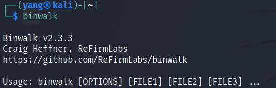

# 使用教程

[官方用法教程](https://github.com/ReFirmLabs/binwalk/wiki/Usage)

## 命令行参数

```shell
Usage: binwalk [OPTIONS] [FILE1] [FILE2] [FILE3] ...

Disassembly Scan Options:
    -Y, --disasm                 Identify the CPU architecture of a file using the capstone disassembler
    -T, --minsn=<int>            Minimum number of consecutive instructions to be considered valid (default: 500)
    -k, --continue               Don't stop at the first match

Signature Scan Options:
    -B, --signature              Scan target file(s) for common file signatures
    -R, --raw=<str>              Scan target file(s) for the specified sequence of bytes
    -A, --opcodes                Scan target file(s) for common executable opcode signatures
    -m, --magic=<file>           Specify a custom magic file to use
    -b, --dumb                   Disable smart signature keywords
    -I, --invalid                Show results marked as invalid
    -x, --exclude=<str>          Exclude results that match <str>
    -y, --include=<str>          Only show results that match <str>

Extraction Options:
    -e, --extract                Automatically extract known file types
    -D, --dd=<type[:ext[:cmd]]>  Extract <type> signatures (regular expression), give the files an extension of <ext>, and execute <cmd>
    -M, --matryoshka             Recursively scan extracted files
    -d, --depth=<int>            Limit matryoshka recursion depth (default: 8 levels deep)
    -C, --directory=<str>        Extract files/folders to a custom directory (default: current working directory)
    -j, --size=<int>             Limit the size of each extracted file
    -n, --count=<int>            Limit the number of extracted files
    -0, --run-as=<str>           Execute external extraction utilities with the specified user's privileges
    -1, --preserve-symlinks      Do not sanitize extracted symlinks that point outside the extraction directory (dangerous)
    -r, --rm                     Delete carved files after extraction
    -z, --carve                  Carve data from files, but don't execute extraction utilities
    -V, --subdirs                Extract into sub-directories named by the offset

Entropy Options:
    -E, --entropy                Calculate file entropy
    -F, --fast                   Use faster, but less detailed, entropy analysis
    -J, --save                   Save plot as a PNG
    -Q, --nlegend                Omit the legend from the entropy plot graph
    -N, --nplot                  Do not generate an entropy plot graph
    -H, --high=<float>           Set the rising edge entropy trigger threshold (default: 0.95)
    -L, --low=<float>            Set the falling edge entropy trigger threshold (default: 0.85)

Binary Diffing Options:
    -W, --hexdump                Perform a hexdump / diff of a file or files
    -G, --green                  Only show lines containing bytes that are the same among all files
    -i, --red                    Only show lines containing bytes that are different among all files
    -U, --blue                   Only show lines containing bytes that are different among some files
    -u, --similar                Only display lines that are the same between all files
    -w, --terse                  Diff all files, but only display a hex dump of the first file

Raw Compression Options:
    -X, --deflate                Scan for raw deflate compression streams
    -Z, --lzma                   Scan for raw LZMA compression streams
    -P, --partial                Perform a superficial, but faster, scan
    -S, --stop                   Stop after the first result

General Options:
    -l, --length=<int>           Number of bytes to scan
    -o, --offset=<int>           Start scan at this file offset
    -O, --base=<int>             Add a base address to all printed offsets
    -K, --block=<int>            Set file block size
    -g, --swap=<int>             Reverse every n bytes before scanning
    -f, --log=<file>             Log results to file
    -c, --csv                    Log results to file in CSV format
    -t, --term                   Format output to fit the terminal window
    -q, --quiet                  Suppress output to stdout
    -v, --verbose                Enable verbose output
    -h, --help                   Show help output
    -a, --finclude=<str>         Only scan files whose names match this regex
    -p, --fexclude=<str>         Do not scan files whose names match this regex
    -s, --status=<int>           Enable the status server on the specified port
```

### 中文翻译

```shell
用法: binwalk [选项] [文件1] [文件2] [文件3] ...

文件签名扫描选项:

    -B, --signature              使用常见的文件签名扫描目标文件
    -R, --raw=<str>              使用指定字节序列扫描目标文件
    -A, --opcodes                使用普通可执行操作码签名扫描目标文件
    -m, --magic=<file>          使用指定的特殊格式文件
    -b, --dumb                   禁用智能签名关键字
    -I, --invalid                显示标记为无效的结果
    -x, --exclude=<str>          排除与str相匹配的结果
    -y, --include=<str>          只显示与str相匹配的结果

提取选项:
    -e, --extract                自动提取已知的文件类型
    -D, --dd=<type:ext:cmd>      提取类型的签名<type>, 文件扩展名为 <ext>, 执行的命令 <cmd>
    -M, --matryoshka             递归扫描提取文件
    -d, --depth=<int>            限制-M递归的范围 (默认值: 8次)
    -C, --directory=<str>       提取文件或文件夹至指定文件夹 (默认值: 当前工作文件夹)
    -j, --size=<int>            限制每个提取文件的大小
    -n, --count=<int>            限制提取文件的数量
    -r, --rm                     清除在提取过程中提取工具无法处理的零大小文件。
    -z, --carve                  从文件中切割数据，但是不执行提取程序

熵分析选项:
    -E, --entropy                计算文件熵
    -F, --fast                   使用快速但是不详细的熵分析
    -J, --save                   自动将由-E生成的的熵图保存为PNG文件而不是直接显示。
    -Q, --nlegend                将熵图的说明省略
    -N, --nplot                  不生成熵图
    -H, --high=<float>           设置上升边缘熵触发阈值 (默认值: 0.95)
    -L, --low=<float>           设置下降边缘熵触发阈值 (默认值: 0.85)

二进制比较选项:
    -W, --hexdump                执行输入文件的十六进制转储(s)和颜色编码区分:绿色—这些字节在所有文件中都是相同的。红色-这些字节在所有文件中都是不同的。蓝色—这些字节在某些文件中是不同的。
    -G, --green                  只显示在所有文件中都相同的字节所在的行
    -i, --red                    只显示在所有文件中都不相同的字节所在的行
    -U, --blue                  只显示在某些文件中都不相同的字节所在的行
    -w, --terse                  比较所有文件，但是只显示第一个文件的16进制转储

原始压缩选项:
    -X, --deflate                用蛮力识别可能的原始压缩数据流
    -Z, --lzma                   扫描原始LZMA压缩流
    -P, --partial                只使用常用的压缩选项搜索压缩流，速度快。
    -S, --stop                   在获得第一个结果后停止

通用选项:
    -l, --length=<int>           需扫描的字节数
    -o, --offset=<int>          跳过文件偏移量开始扫描
    -O, --base=<int>             为所有的打印结果偏移量增加一个基址
    -K, --block=<int>            设置文件块大小
    -g, --swap=<int>             在扫描前每n字节反转一次
    -f, --log=<file>             把结果记录到文件
    -c, --csv                    把结果记录到CSV文件中
    -t, --term                   格式化输出，已使用终端窗口
    -q, --quiet                  禁用输出到标准输出
    -v, --verbose                启用详细输出，包括目标文件MD5和扫描时间戳。
    -h, --help                   显示帮助信息
    -a, --finclude=<str>         只扫描文件名匹配正则表达式的文件
    -p, --fexclude=<str>         不扫描文件名匹配正则表达式的文件
    -s, --status=<int>           在指定端口启动状态服务器
```

# 运行

## 用例1-失败

用例`firmwalker`中给的固件[example](https://onedrive.live.com/?authkey=%21AHJ5i3XofvZUIu8&id=DDE735C9853110E7%217782&cid=DDE735C9853110E7)

Windows解压时发现如下情况

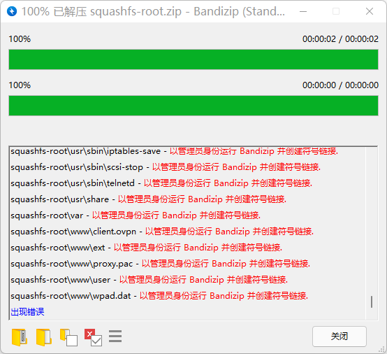

Kali中解压也是报错

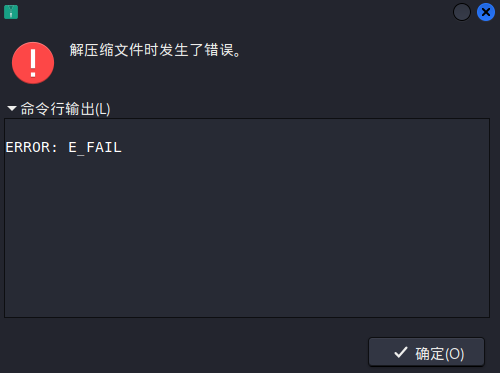

## 用例2-路由器固件

[常见路由器固件下载](https://www.kejiwanjia.com/jiaocheng/hardware/luyou/893.html)

分析[小米4路由器固件](https://drive.google.com/drive/folders/1L0fS0CFJwybh9xwIwM4j4a19kZnU446j)

### 对`.bin`操作

#### 运行`-B`

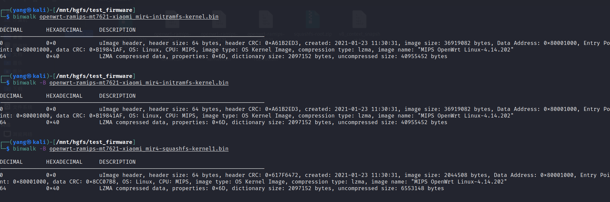

```shell
┌──(yang㉿kali)-[/mnt/hgfs/test_firmware]
└─$ binwalk -B openwrt-ramips-mt7621-xiaomi_mir4-squashfs-kernel1.bin 

DECIMAL       HEXADECIMAL     DESCRIPTION
--------------------------------------------------------------------------------
0             0x0             uImage header, header size: 64 bytes, header CRC: 0x617F6472, created: 2021-01-23 11:30:31, image size: 2044508 bytes, Data Address: 0x80001000, Entry Point: 0x80001000, data CRC: 0x8CC07B8, OS: Linux, CPU: MIPS, image type: OS Kernel Image, compression type: lzma, image name: "MIPS OpenWrt Linux-4.14.202"
64            0x40            LZMA compressed data, properties: 0x6D, dictionary size: 2097152 bytes, uncompressed size: 6553148 bytes
```

#### 运行`-Z`: 扫描原始LZMA压缩流

一直卡着

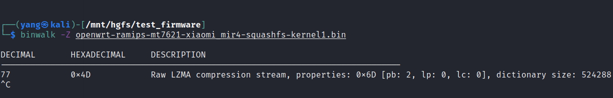

又运行一次, dictionary size 不同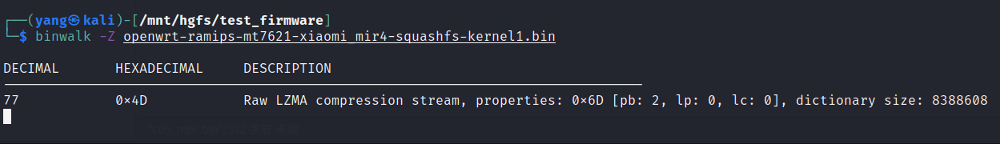

#### 运行`-E`:Entropy-失败

好像是matplotlib出了问题

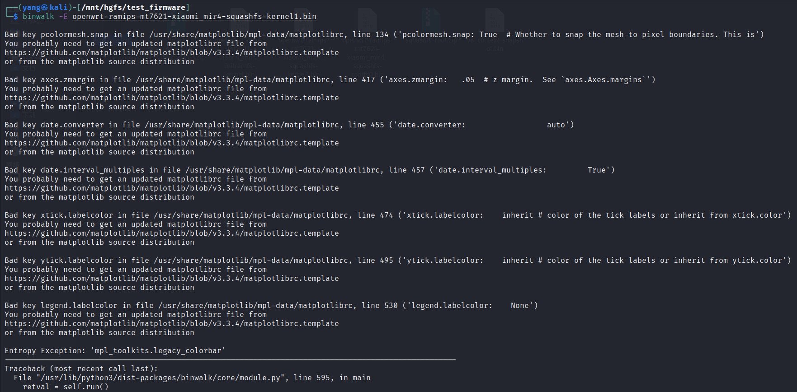

安装matplotlib, anaconda之后

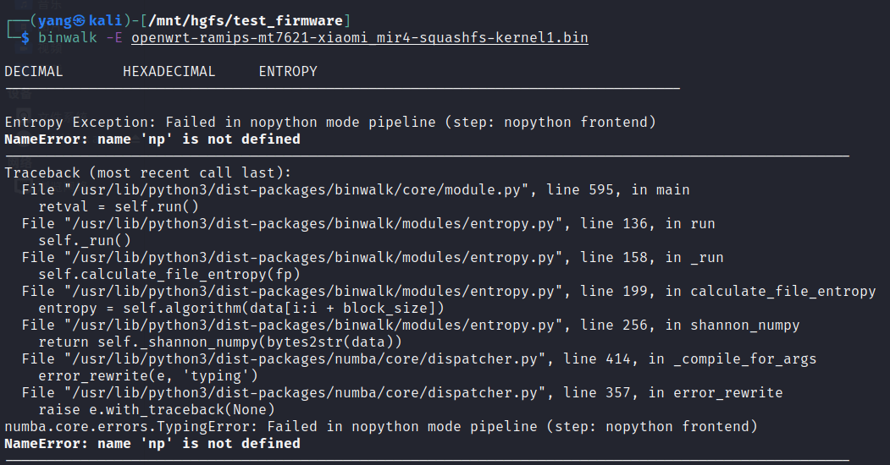

应该是binwalk安装时候出了问题,没有安装dependency

安装dependence之后仍旧如上的报错信息

#### 使用lzma解压-失败

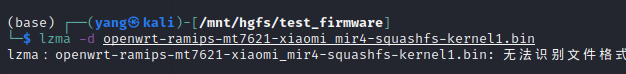

#### 使用`-e`提取

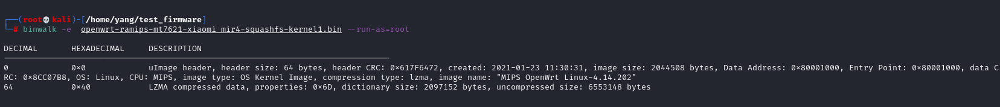

得到文件夹

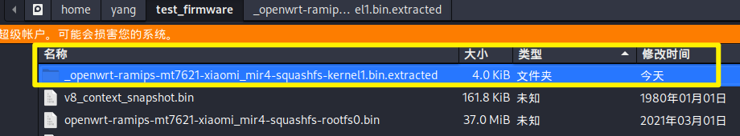

文件夹中内容

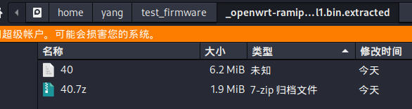

用`7z`解压缩`40.7z`, 解压后就是文件`40`

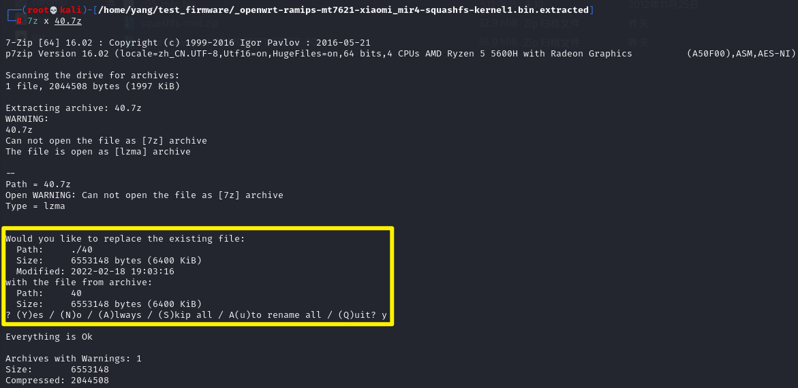

### 对提取后的文件`40`操作

#### 运行`-B`

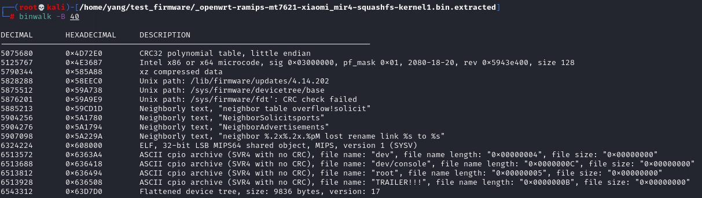

#### 运行`-e`再次提取

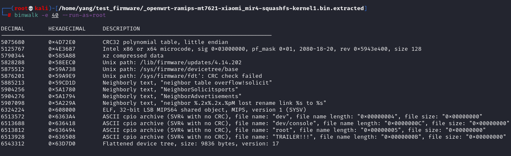

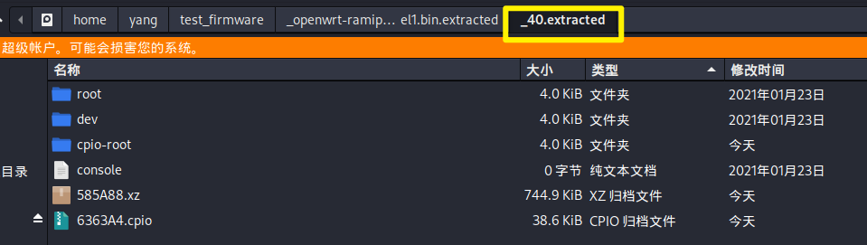

对`585A88.xz`解压缩发生错误

