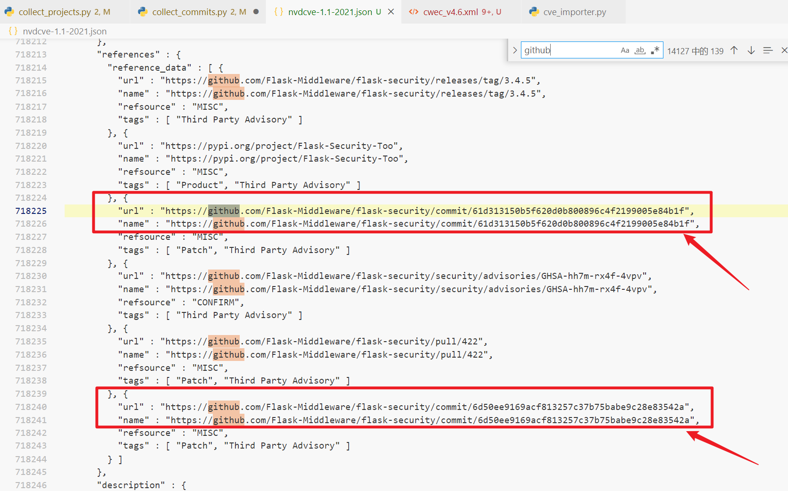
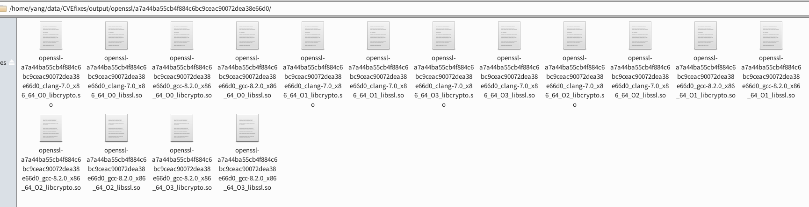

构建漏洞数据库

CVEfixes报告

[原论文地址](https://arxiv.org/abs/2107.08760)

[原项目地址](https://github.com/secureIT-project/CVEfixes)

[我的fork](https://github.com/YangWenhao3906/CVEfixes):目前包含注释,并将cwe更新为最新

# CVEfixes环境配置

2022.1.10

## Git clone

ssh密钥对: 保存在”.ssh”

```
ssh-keygen -t rsa -C "youremail@example.com"
```

git clone: 对应ssh链接

```
git clone git@github.com:secureIT-project/CVEfixes.git
```

## anaconda环境

创建

conda env create -f environment.yml


### 问题: conflict

```
Collecting guesslang~=2.0]()

 Downloading guesslang-2.2.0-py3-none-any.whl (2.5 MB)

 Downloading guesslang-2.0.3-py3-none-any.whl (2.1 MB)

 Downloading guesslang-2.0.1-py3-none-any.whl (2.1 MB)

 Downloading guesslang-2.0.0-py3-none-any.whl (13.0 MB)

INFO: pip is looking at multiple versions of <Python from Requires-Python> to determine which version is compatible with other requirements. This could take a while.

INFO: pip is looking at multiple versions of pydriller to determine which version is compatible with other requirements. This could take a while.

 

The conflict is caused by:

  guesslang 2.2.1 depends on tensorflow==2.5.0

  guesslang 2.2.0 depends on tensorflow==2.5.0

  guesslang 2.0.3 depends on tensorflow==2.5.0

  guesslang 2.0.1 depends on tensorflow==2.2.0

  guesslang 2.0.0 depends on tensorflow==2.2.0

 

To fix this you could try to:

\1. loosen the range of package versions you've specified

\2. remove package versions to allow pip attempt to solve the dependency conflict

 

Pip subprocess error:

ERROR: Cannot install -r /home/yang/Documents/CVE/CVEfixes/condaenv.ko814pto.requirements.txt (line 2) because these package versions have conflicting dependencies.

ERROR: ResolutionImpossible: for help visit https://pip.pypa.io/en/latest/user_guide/#fixing-conflicting-dependencies

 

CondaEnvException: Pip failed
```


### 解决1(失败): 采用作者的.frozen.yml

in addition, we provide "frozen" versions that list the actual versions at the time of development as respectively requirements.frozen.txt and environment.frozen.yml

```
conda env create -f environment.frozen.yml
```

报错: 应该是需要自己导入包

```
Collecting package metadata (repodata.json): done

Solving environment: failed

 

ResolvePackageNotFound:

 \- cryptography==3.4.7=py39ha2c9959_0

 \- nbconvert==6.0.7=py39h6e9494a_3

 \- zstd==1.4.9=h582d3a0_0

 \- mysql-common==8.0.23=h694c41f_2
```

(未操作) 将not found的package放入pip中

### 解决2(失败):删除指定的版本号, 选择让pip自动决定

```
- pip:

  \- PyDriller~=2.0

  \- guesslang~=2.0
```

删除`guesslang`的版本号

```
- pip:

  \- PyDriller~=2.0

  \- guesslang
```

报错

```
Collecting guesslang

 Using cached guesslang-2.2.0-py3-none-any.whl (2.5 MB)

 Using cached guesslang-2.0.3-py3-none-any.whl (2.1 MB)

 Using cached guesslang-2.0.1-py3-none-any.whl (2.1 MB)

 Using cached guesslang-2.0.0-py3-none-any.whl (13.0 MB)

 Downloading guesslang-0.9.3-py3-none-any.whl (3.2 MB)

 Downloading guesslang-0.9.1-py3-none-any.whl (3.2 MB)

INFO: pip is looking at multiple versions of <Python from Requires-Python> to determine which version is compatible with other requirements. This could take a while.

INFO: pip is looking at multiple versions of pydriller to determine which version is compatible with other requirements. This could take a while.

 

The conflict is caused by:

  guesslang 2.2.1 depends on tensorflow==2.5.0

  guesslang 2.2.0 depends on tensorflow==2.5.0

  guesslang 2.0.3 depends on tensorflow==2.5.0

  guesslang 2.0.1 depends on tensorflow==2.2.0

  guesslang 2.0.0 depends on tensorflow==2.2.0

  guesslang 0.9.3 depends on tensorflow==1.7.0rc1

  guesslang 0.9.1 depends on tensorflow==1.1.0
```

与上面报错内容相同, 都是不同的guesslang依赖不同的TensorFlow, 目前没搞懂原理

发现GitHub的guesslang有相同的issue(https://github.com/yoeo/guesslang/issues/56)

 

我认为的原因: 

Collecting的guesslang的包有好几个, 包括2.2.1, 2.2.0, 2.0.3等, 依赖的TensorFlow版本不同, 所以才会conflicting

 

### 解决3(失败):在base内可以成功安装guesslang


举例: pip3安装guesslang

```
pip3 install guesslang
```

首先自动安装TensorFlow

```
collecting guesslang

 Using cached guesslang-2.2.1-py3-none-any.whl (2.5 MB)

Collecting tensorflow==2.5.0

 Downloading tensorflow-2.5.0-cp38-cp38-manylinux2010_x86_64.whl (454.4 MB)

   |████████████████████████████████| 454.4 MB 23 kB/s 

Collecting tensorboard~=2.5

 Downloading tensorboard-2.7.0-py3-none-any.whl (5.8 MB)

   |████████████████████████████████| 5.8 MB 3.2 MB/s
(略)
```

再次运行创建环境的指令, 需要将原本的环境文件删除


报错: 与之前相同

 

### 解决4(错误):将guesslang放入dependencies中

思路: 既然已经完成了base中的安装

解决: 将guesslang放入dependencies中

```
dependencies:

 \- python~=3.8

 \- pandas~=1.2

 \- numpy~=1.19

 \- requests~=2.24

 \- PyGithub~=1.54

 \- jupyter

 \- seaborn

 \- matplotlib

 \- guesslang

 \- pip

 \- pip:

  \- PyDriller~=2.0
```

运行后报错:

```
Collecting package metadata (repodata.json): done

Solving environment: failed

 

ResolvePackageNotFound:

 \- guesslang
```

### 解决5(错误):将guesslang~=2.2.1放入pip中

报错

```
Pip subprocess error:

\ ERROR: Could not find a version that satisfies the requirement tensorflow==2.5.0 (from guesslang) (from versions: 2.8.0rc0)

ERROR: No matching distribution found for tensorflow==2.5.0

failed

CondaEnvException: Pip failed
```

先将guesslang注释掉

在之后进行安装

Pip3安装-不指定版本

```
pip3 install guesslang

Collecting guesslang

 Using cached guesslang-2.2.1-py3-none-any.whl (2.5 MB)

 Using cached guesslang-2.2.0-py3-none-any.whl (2.5 MB)

 Using cached guesslang-2.0.3-py3-none-any.whl (2.1 MB)

 Using cached guesslang-2.0.1-py3-none-any.whl (2.1 MB)

 Using cached guesslang-2.0.0-py3-none-any.whl (13.0 MB)

 Using cached guesslang-0.9.3-py3-none-any.whl (3.2 MB)

 Using cached guesslang-0.9.1-py3-none-any.whl (3.2 MB)

Collecting numpy<1.13,>=1.12

 Using cached numpy-1.12.1.zip (4.8 MB)

 Preparing metadata (setup.py) ... done

ERROR: Cannot install guesslang==0.9.1, guesslang==0.9.3, guesslang==2.0.0, guesslang==2.0.1, guesslang==2.0.3, guesslang==2.2.0 and guesslang==2.2.1 because these package versions have conflicting dependencies.

 

The conflict is caused by:

  guesslang 2.2.1 depends on tensorflow==2.5.0

  guesslang 2.2.0 depends on tensorflow==2.5.0

  guesslang 2.0.3 depends on tensorflow==2.5.0

  guesslang 2.0.1 depends on tensorflow==2.2.0

  guesslang 2.0.0 depends on tensorflow==2.2.0

  guesslang 0.9.3 depends on tensorflow==1.7.0rc1

  guesslang 0.9.1 depends on tensorflow==1.1.0

 

To fix this you could try to:

\1. loosen the range of package versions you've specified

\2. remove package versions to allow pip attempt to solve the dependency conflict

 

ERROR: ResolutionImpossible: for help visit https://pip.pypa.io/en/latest/user_guide/#fixing-conflicting-dependencies
```

Pip3安装-指定版本

```
pip3 install guesslang~=2.2.1

Collecting guesslang~=2.2.1

 Using cached guesslang-2.2.1-py3-none-any.whl (2.5 MB)

ERROR: Could not find a version that satisfies the requirement tensorflow==2.5.0 (from guesslang) (from versions: 2.8.0rc0)

ERROR: No matching distribution found for tensorflow==2.5.0
```

### 解决6(失败):channel增加pipy

问题: 为什么在bash中成功安装, 在CVEfixes中无法成功安装?

猜测: channel的问题, 在yml中添加channel = pipy

报错: 与之前相同, 仍然是conflicts

解决: 加上版本号2.1.0

```
name: CVEfixes

channels:

 \- conda-forge

 \- defaults

 \- pypi

dependencies:

 \- python~=3.8

 \- pandas~=1.2

 \- numpy~=1.19

 \- requests~=2.24

 \- PyGithub~=1.54

 \- jupyter

 \- seaborn

 \- matplotlib

 \- pip

 \- pip:

  \- PyDriller~=2.0

  \- guesslang~=2.2.1


```

报错: 

```
Pip subprocess error:

ERROR: Could not find a version that satisfies the requirement tensorflow==2.5.0 (from guesslang) (from versions: 2.8.0rc0)

ERROR: No matching distribution found for tensorflow==2.5.0

failed 

CondaEnvException: Pip failed
```

 

### 解决7(成功):先安装TensorFlow

尝试首先安装TensorFlow

```
(CVEfixes) yang@yangwenhao:~/Documents/CVE/CVEfixes$ conda install tensorflow
```

然后再用pip3安装guesslang, 成功

```
(CVEfixes) yang@yangwenhao:~/Documents/CVE/CVEfixes$ pip3 install guesslang

Collecting guesslang

 Using cached guesslang-2.2.1-py3-none-any.whl (2.5 MB)

Collecting tensorflow==2.5.0

 Downloading tensorflow-2.5.0-cp39-cp39-manylinux2010_x86_64.whl (454.4 MB)

   |████████████████████████████████| 454.4 MB 16 kB/s       

Requirement already satisfied: google-pasta~=0.2 in /home/yang/anaconda3/envs/CVEfixes/lib/python3.9/site-packages (from tensorflow==2.5.0->guesslang) (0.2.0)

Requirement already satisfied: termcolor~=1.1.0 in /home/yang/anaconda3/envs/CVEfixes/lib/python3.9/site-packages (from tensorflow==2.5.0->guesslang) (1.1.0)

Requirement already satisfied: opt-einsum~=3.3.0 in /home/yang/anaconda3/envs/CVEfixes/lib/python3.9/site-packages (from tensorflow==2.5.0->guesslang) (3.3.0)

Collecting six~=1.15.0

 Downloading six-1.15.0-py2.py3-none-any.whl (10 kB)

Collecting tensorflow-estimator<2.6.0,>=2.5.0rc0

 Using cached tensorflow_estimator-2.5.0-py2.py3-none-any.whl (462 kB)

Requirement already satisfied: flatbuffers~=1.12.0 in /home/yang/anaconda3/envs/CVEfixes/lib/python3.9/site-packages (from tensorflow==2.5.0->guesslang) (1.12)

Requirement already satisfied: keras-preprocessing~=1.1.2 in /home/yang/anaconda3/envs/CVEfixes/lib/python3.9/site-packages (from tensorflow==2.5.0->guesslang) (1.1.2)
```


# 运行代码-失败

## 尝试运行代码-失败

### 第一次运行, 报错Key Error

原因是: 访问了不在dict中的key

猜测: 没有把cve list下载下来

```
(CVEfixes) yang@yangwenhao:~/Documents/CVE/CVEfixes$ sh Code/create_CVEfixes_from_scratch.sh

Traceback (most recent call last):

 File "/home/yang/Documents/CVE/CVEfixes/Code/collect_projects.py", line 243, in <module>

  cve_importer.import_cves()

 File "/home/yang/Documents/CVE/CVEfixes/Code/cve_importer.py", line 146, in import_cves

  df_cwes = extract_cwe()

 File "/home/yang/Documents/CVE/CVEfixes/Code/extract_cwe_record.py", line 29, in extract_cwe

  cwefile = cwe_zip.extract("cwec_v4.4.xml", cf.DATA_PATH)

 File "/home/yang/anaconda3/envs/CVEfixes/lib/python3.9/zipfile.py", line 1616, in extract

  return self._extract_member(member, path, pwd)

 File "/home/yang/anaconda3/envs/CVEfixes/lib/python3.9/zipfile.py", line 1655, in _extract_member

  member = self.getinfo(member)

 File "/home/yang/anaconda3/envs/CVEfixes/lib/python3.9/zipfile.py", line 1429, in getinfo

   raise KeyError(

KeyError: "There is no item named 'cwec_v4.4.xml' in the archive"
```


### 直接第二次点击运行,不做修改

```
(CVEfixes) yang@yangwenhao:~/Documents/CVE/CVEfixes$ sh Code/create_CVEfixes_from_scratch.sh

01/10/2022 12:10:11 WARNING: The cve table already exists, loading and continuing extraction...

Traceback (most recent call last):

 File "/home/yang/anaconda3/envs/CVEfixes/lib/python3.9/site-packages/urllib3/connectionpool.py", line 703, in urlopen

  httplib_response = self._make_request(

 File "/home/yang/anaconda3/envs/CVEfixes/lib/python3.9/site-packages/urllib3/connectionpool.py", line 449, in _make_request

  six.raise_from(e, None)

 File "<string>", line 3, in raise_from

 File "/home/yang/anaconda3/envs/CVEfixes/lib/python3.9/site-packages/urllib3/connectionpool.py", line 444, in _make_request

  httplib_response = conn.getresponse()

 File "/home/yang/anaconda3/envs/CVEfixes/lib/python3.9/http/client.py", line 1377, in getresponse

  response.begin()

 File "/home/yang/anaconda3/envs/CVEfixes/lib/python3.9/http/client.py", line 320, in begin

  version, status, reason = self._read_status()

 File "/home/yang/anaconda3/envs/CVEfixes/lib/python3.9/http/client.py", line 289, in _read_status

  raise RemoteDisconnected("Remote end closed connection without"

http.client.RemoteDisconnected: Remote end closed connection without response

 

During handling of the above exception, another exception occurred:

 

Traceback (most recent call last):

 File "/home/yang/anaconda3/envs/CVEfixes/lib/python3.9/site-packages/requests/adapters.py", line 440, in send

  resp = conn.urlopen(

 File "/home/yang/anaconda3/envs/CVEfixes/lib/python3.9/site-packages/urllib3/connectionpool.py", line 785, in urlopen

  retries = retries.increment(

 File "/home/yang/anaconda3/envs/CVEfixes/lib/python3.9/site-packages/urllib3/util/retry.py", line 550, in increment

  raise six.reraise(type(error), error, _stacktrace)

 File "/home/yang/anaconda3/envs/CVEfixes/lib/python3.9/site-packages/urllib3/packages/six.py", line 769, in reraise

  raise value.with_traceback(tb)

 File "/home/yang/anaconda3/envs/CVEfixes/lib/python3.9/site-packages/urllib3/connectionpool.py", line 703, in urlopen

  httplib_response = self._make_request(

 File "/home/yang/anaconda3/envs/CVEfixes/lib/python3.9/site-packages/urllib3/connectionpool.py", line 449, in _make_request

  six.raise_from(e, None)

 File "<string>", line 3, in raise_from

 File "/home/yang/anaconda3/envs/CVEfixes/lib/python3.9/site-packages/urllib3/connectionpool.py", line 444, in _make_request

  httplib_response = conn.getresponse()

 File "/home/yang/anaconda3/envs/CVEfixes/lib/python3.9/http/client.py", line 1377, in getresponse

  response.begin()

 File "/home/yang/anaconda3/envs/CVEfixes/lib/python3.9/http/client.py", line 320, in begin

  version, status, reason = self._read_status()

 File "/home/yang/anaconda3/envs/CVEfixes/lib/python3.9/http/client.py", line 289, in _read_status

  raise RemoteDisconnected("Remote end closed connection without"

urllib3.exceptions.ProtocolError: ('Connection aborted.', RemoteDisconnected('Remote end closed connection without response'))

 

During handling of the above exception, another exception occurred:

 

Traceback (most recent call last):

 File "/home/yang/Documents/CVE/CVEfixes/Code/collect_projects.py", line 245, in <module>

  store_tables(get_ref_links())

 File "/home/yang/Documents/CVE/CVEfixes/Code/collect_projects.py", line 81, in get_ref_links

  unfetched_urls = filter_urls(unique_urls)

 File "/home/yang/Documents/CVE/CVEfixes/Code/collect_projects.py", line 35, in filter_urls

  code = requests.head(url).status_code

 File "/home/yang/anaconda3/envs/CVEfixes/lib/python3.9/site-packages/requests/api.py", line 102, in head

  return request('head', url, **kwargs)

 File "/home/yang/anaconda3/envs/CVEfixes/lib/python3.9/site-packages/requests/api.py", line 61, in request

  return session.request(method=method, url=url, **kwargs)

 File "/home/yang/anaconda3/envs/CVEfixes/lib/python3.9/site-packages/requests/sessions.py", line 529, in request

  resp = self.send(prep, **send_kwargs)

 File "/home/yang/anaconda3/envs/CVEfixes/lib/python3.9/site-packages/requests/sessions.py", line 645, in send

  r = adapter.send(request, **kwargs)

 File "/home/yang/anaconda3/envs/CVEfixes/lib/python3.9/site-packages/requests/adapters.py", line 501, in send

  raise ConnectionError(err, request=request)

requests.exceptions.ConnectionError: ('Connection aborted.', RemoteDisconnected('Remote end closed connection without response'))
```


### 更改: 将所有的cwec_v4.4改为4.6

Cwec_v4.6即最新版

成功下载


 


 

报错信息: type error

```shell
(CVEfixes) yang@yangwenhao:~/Documents/CVE/CVEfixes$ sh Code/create_CVEfixes_from_scratch.sh

--- Logging error ---

Traceback (most recent call last):

 File "/home/yang/anaconda3/envs/CVEfixes/lib/python3.9/logging/__init__.py", line 1083, in emit

  msg = self.format(record)

 File "/home/yang/anaconda3/envs/CVEfixes/lib/python3.9/logging/__init__.py", line 927, in format

  return fmt.format(record)

 File "/home/yang/anaconda3/envs/CVEfixes/lib/python3.9/logging/__init__.py", line 663, in format

  record.message = record.getMessage()

 File "/home/yang/anaconda3/envs/CVEfixes/lib/python3.9/logging/__init__.py", line 367, in getMessage

  msg = msg % self.args

TypeError: not all arguments converted during string formatting

Call stack:

 File "/home/yang/Documents/CVE/CVEfixes/Code/collect_projects.py", line 243, in <module>

  cve_importer.import_cves()

 File "/home/yang/Documents/CVE/CVEfixes/Code/cve_importer.py", line 121, in import_cves

  cf.logger.warning('Reusing', year, 'CVE json file that was downloaded earlier...')

Message: 'Reusing'

Arguments: (2022, 'CVE json file that was downloaded earlier...')
```

更改: 把year的遍历改成current year而不是+1


不顶用, 报错信息相同

结论: 先老老实实把代码逻辑搞明白吧…

 

# 小插曲

2022.1.11

## 远程连接的Ubuntu的屏幕抖动-解决

尝试: 更改Windows远程连接中的设置等, 未能解决

经重启解决问题

```shell
Reboot
```

## Ubuntu与Windows共享文件夹-未解决

**TODO 尚未解决**

暂时安装了Samba, 并add user to Samba share

不知为何, 在local network share时会出现error没有权限

## 远程桌面经常断开-未解决

可能是校园网HIT-WLAN的问题

- 下载team viewer 但是无法登录, 查找原因, 可能是无法在中国连接服务器, 作罢

- 想要用Kali-Linux破解学校用于开发测试的syndev的密码, 无奈暂时没有没有解决Kali虚拟机抓包的问题, 可能是需要无线网卡

哎, 心累

```
这种不是特别影响工作的事情就先罢了, 太影响心情了!!
```

## GitHub同步笔记

https://blog.csdn.net/oPengXiaoLiang/article/details/100678908  相关教程


# CVEfixes阅读代码

## 阅读方式

### 使用 Shpinx 为 Python 项目自动生成文档

[使用 Shpinx 为 Python 项目自动生成文档相关教程](https://juejin.cn/post/6882904677373968397) 

### VSCode环境设置

设置为当前conda虚拟环境的Python


### 本地阅读并撰写注释

远程桌面有延迟体验不佳, 暂时使用Windows VSCode进行阅读代码, 并撰写`注释`

### 阅读代码策略

- 每行: 每行撰写注释
- 每段: 分析每段代码的input&output
- 顺序: 从main运行顺序

## cve_importer

### 问题: CWE中表项含义

weaknesses,Categories,Views,External_References分别是什么

- weaknesses: 记载每个漏洞
- categories: 总结漏洞类型
- views: 

### 将CWE和CVE关联

#### 完成关联


#### 存在一对多: 一个CVE对应多个CWE


### pandas补充:

#### explode: 将类似列表的每个元素转换为一行，从而复制索引值。

```python
>>> df = pd.DataFrame({'A': [[1, 2, 3], 'foo', [], [3, 4]], 'B': 1})
>>> df
           A  B
0  [1, 2, 3]  1
1        foo  1
2         []  1
3     [3, 4]  1
>>> df.explode('A')
     A  B
0    1  1
0    2  1
0    3  1
1  foo  1
2  NaN  1
3    3  1
3    4  1
```

#### pandas reset_index

数据清洗时，会将带空值的行删除，此时DataFrame或Series类型的数据不再是连续的索引，可以使用**reset_index()重置索引**。

```python
import pandas as pd
import numpy as np
df = pd.DataFrame(np.arange(20).reshape(5,4),index=[1,3,4,6,8])
print(df)
    0   1   2   3
1   0   1   2   3
3   4   5   6   7
4   8   9  10  11
6  12  13  14  15
8  16  17  18  19
```

 reset_index()重置索引：

```python
print(df.reset_index())
   index   0   1   2   3
0      1   0   1   2   3
1      3   4   5   6   7
2      4   8   9  10  11
3      6  12  13  14  15
4      8  16  17  18  19
```

在获得新的index，原来的index变成数据列，保留下来。

不想保留原来的index，使用参数 `drop=True`，默认 False。

```python
print(df.reset_index(drop=True))
    0   1   2   3
0   0   1   2   3
1   4   5   6   7
2   8   9  10  11
3  12  13  14  15
4  16  17  18  19
```

## collect_projects

### fixes表创建

将ref在GitHub等代码托管网站中的放入df_fixes,并通过http访问测试过滤不存在的url

#### get_ref_links

调用extract_project_links创建df_fixes, 通过http访问测试过滤不存在的url

#### extract_project_links

将ref在GitHub等代码托管网站中的放入df_fixes


### commits表

#### store_tables

结构


##### 疑问


[随便找了一个ref的网址](https://github.com/rpm-software-management/rpm/commit/d6a86b5e69e46cc283b1e06c92343319beb42e21)


一个cve多个commit

##### 疑问


# 代码运行

## 直接运行未翻墙

报错: requests.exceptions.ConnectionError: ('Connection aborted.', RemoteDisconnected('Remote end closed connection without response')

**猜测**: 可能是没有搭梯子

```shell
Traceback (most recent call last):
  File "/home/yang/Documents/CVE/CVEfixes/Code/collect_projects.py", line 277, in <module>
    store_tables(get_ref_links())
  File "/home/yang/Documents/CVE/CVEfixes/Code/collect_projects.py", line 97, in get_ref_links
    unfetched_urls = filter_urls(unique_urls)
  File "/home/yang/Documents/CVE/CVEfixes/Code/collect_projects.py", line 37, in filter_urls
    code = requests.head(url).status_code
  File "/home/yang/anaconda3/envs/CVEfixes/lib/python3.9/site-packages/requests/api.py", line 102, in head
    return request('head', url, **kwargs)
  File "/home/yang/anaconda3/envs/CVEfixes/lib/python3.9/site-packages/requests/api.py", line 61, in request
    return session.request(method=method, url=url, **kwargs)
  File "/home/yang/anaconda3/envs/CVEfixes/lib/python3.9/site-packages/requests/sessions.py", line 529, in request
    resp = self.send(prep, **send_kwargs)
  File "/home/yang/anaconda3/envs/CVEfixes/lib/python3.9/site-packages/requests/sessions.py", line 645, in send
    r = adapter.send(request, **kwargs)
  File "/home/yang/anaconda3/envs/CVEfixes/lib/python3.9/site-packages/requests/adapters.py", line 501, in send
    raise ConnectionError(err, request=request)
requests.exceptions.ConnectionError: ('Connection aborted.', RemoteDisconnected('Remote end closed connection without response'))
```

## 经过代理

经过代理,报错信息更改:

requests.exceptions.SSLError: HTTPSConnectionPool

[查看网上对于此报错的教程](https://cloud.tencent.com/developer/article/1572216)

将请求中的verify字段从默认的True改为False,不验证证书

```shell
During handling of the above exception, another exception occurred:

Traceback (most recent call last):
  File "/home/yang/Documents/CVE/CVEfixes/Code/collect_projects.py", line 277, in <module>
    store_tables(get_ref_links())
  File "/home/yang/Documents/CVE/CVEfixes/Code/collect_projects.py", line 97, in get_ref_links
    unfetched_urls = filter_urls(unique_urls)
  File "/home/yang/Documents/CVE/CVEfixes/Code/collect_projects.py", line 37, in filter_urls
    code = requests.head(url).status_code
  File "/home/yang/anaconda3/envs/CVEfixes/lib/python3.9/site-packages/requests/api.py", line 102, in head
    return request('head', url, **kwargs)
  File "/home/yang/anaconda3/envs/CVEfixes/lib/python3.9/site-packages/requests/api.py", line 61, in request
    return session.request(method=method, url=url, **kwargs)
  File "/home/yang/anaconda3/envs/CVEfixes/lib/python3.9/site-packages/requests/sessions.py", line 529, in request
    resp = self.send(prep, **send_kwargs)
  File "/home/yang/anaconda3/envs/CVEfixes/lib/python3.9/site-packages/requests/sessions.py", line 645, in send
    r = adapter.send(request, **kwargs)
  File "/home/yang/anaconda3/envs/CVEfixes/lib/python3.9/site-packages/requests/adapters.py", line 517, in send
    raise SSLError(e, request=request)
requests.exceptions.SSLError: HTTPSConnectionPool(host='github.com', port=443): Max retries exceeded with url: /digint/btrbk (Caused by SSLError(SSLEOFError(8, 'EOF occurred in violation of protocol (_ssl.c:1129)')))

```


## 不验证证书


报出一堆InsecureRequestWarning

很奇怪, 又报了相同的SSLError

```shell
Traceback (most recent call last):
  File "/home/yang/Documents/CVE/CVEfixes/Code/collect_projects.py", line 277, in <module>
    store_tables(get_ref_links())
  File "/home/yang/Documents/CVE/CVEfixes/Code/collect_projects.py", line 97, in get_ref_links
    unfetched_urls = filter_urls(unique_urls)
  File "/home/yang/Documents/CVE/CVEfixes/Code/collect_projects.py", line 37, in filter_urls
    code = requests.head(url,verify=False).status_code
  File "/home/yang/anaconda3/envs/CVEfixes/lib/python3.9/site-packages/requests/api.py", line 102, in head
    return request('head', url, **kwargs)
  File "/home/yang/anaconda3/envs/CVEfixes/lib/python3.9/site-packages/requests/api.py", line 61, in request
    return session.request(method=method, url=url, **kwargs)
  File "/home/yang/anaconda3/envs/CVEfixes/lib/python3.9/site-packages/requests/sessions.py", line 529, in request
    resp = self.send(prep, **send_kwargs)
  File "/home/yang/anaconda3/envs/CVEfixes/lib/python3.9/site-packages/requests/sessions.py", line 645, in send
    r = adapter.send(request, **kwargs)
  File "/home/yang/anaconda3/envs/CVEfixes/lib/python3.9/site-packages/requests/adapters.py", line 517, in send
    raise SSLError(e, request=request)
requests.exceptions.SSLError: HTTPSConnectionPool(host='github.com', port=443): Max retries exceeded with url: /kylebrowning/APNSwift (Caused by SSLError(SSLEOFError(8, 'EOF occurred in violation of protocol (_ssl.c:1129)')))
```

看了网上的blog有点蒙

接着又什么都不改,又运行了一次,这次是ProxyError,

猜测: 可能是关机

```shell
http.client.RemoteDisconnected: Remote end closed connection without response

During handling of the above exception, another exception occurred:

Traceback (most recent call last):
  File "/home/yang/anaconda3/envs/CVEfixes/lib/python3.9/site-packages/requests/adapters.py", line 440, in send
    resp = conn.urlopen(
  File "/home/yang/anaconda3/envs/CVEfixes/lib/python3.9/site-packages/urllib3/connectionpool.py", line 785, in urlopen
    retries = retries.increment(
  File "/home/yang/anaconda3/envs/CVEfixes/lib/python3.9/site-packages/urllib3/util/retry.py", line 592, in increment
    raise MaxRetryError(_pool, url, error or ResponseError(cause))
urllib3.exceptions.MaxRetryError: HTTPSConnectionPool(host='github.com', port=443): Max retries exceeded with url: /opencast/opencast (Caused by ProxyError('Cannot connect to proxy.', RemoteDisconnected('Remote end closed connection without response')))

During handling of the above exception, another exception occurred:

Traceback (most recent call last):
  File "/home/yang/Documents/CVE/CVEfixes/Code/collect_projects.py", line 277, in <module>
    store_tables(get_ref_links())
  File "/home/yang/Documents/CVE/CVEfixes/Code/collect_projects.py", line 97, in get_ref_links
    unfetched_urls = filter_urls(unique_urls)
  File "/home/yang/Documents/CVE/CVEfixes/Code/collect_projects.py", line 37, in filter_urls
    code = requests.head(url,verify=False).status_code
  File "/home/yang/anaconda3/envs/CVEfixes/lib/python3.9/site-packages/requests/api.py", line 102, in head
    return request('head', url, **kwargs)
  File "/home/yang/anaconda3/envs/CVEfixes/lib/python3.9/site-packages/requests/api.py", line 61, in request
    return session.request(method=method, url=url, **kwargs)
  File "/home/yang/anaconda3/envs/CVEfixes/lib/python3.9/site-packages/requests/sessions.py", line 529, in request
    resp = self.send(prep, **send_kwargs)
  File "/home/yang/anaconda3/envs/CVEfixes/lib/python3.9/site-packages/requests/sessions.py", line 645, in send
    r = adapter.send(request, **kwargs)
  File "/home/yang/anaconda3/envs/CVEfixes/lib/python3.9/site-packages/requests/adapters.py", line 513, in send
    raise ProxyError(e, request=request)
requests.exceptions.ProxyError: HTTPSConnectionPool(host='github.com', port=443): Max retries exceeded with url: /opencast/opencast (Caused by ProxyError('Cannot connect to proxy.', RemoteDisconnected('Remote end closed connection without response')))

```

又运行了一次


自欺欺人一波


[相关教程](https://stackoverflow.com/questions/33410577/python-requests-exceptions-sslerror-eof-occurred-in-violation-of-protocol)

安装ndg-httpsclient, 但是已经包含在PyOpenSSL里面了


**一个想法: 既然是只用了commits中的,为什么不先用正则表达式把commit网址提取出来, 再进行urls_filter??**

代理配置

xfce中没有找到GUI的代理配置, **如下图这样的页面不存在**


/etc/environment增加如下内容

```shell
http_proxy=127.0.0.1:7890
https_proxy=127.0.0.1:7890
# ftp_proxy=http://myproxy.server.com:8080/
all_proxy=socks5://127.0.0.1:7891
no_proxy="localhost,127.0.0.1,localaddress,.localdomain.com"
HTTP_PROXY=127.0.0.1:7890
HTTPS_PROXY=127.0.0.1:7890
# FTP_PROXY=http://myproxy.server.com:8080/
ALL_PROXY=socks5://127.0.0.1:7891
NO_PROXY="localhost,127.0.0.1,localaddress,.localdomain.com"
```

然后执行

```shell
source /etc/environment
```

# 使用作者提供的数据库


## file_change 文件更改

| columns 柱                        | description 描述                                             |
| --------------------------------- | ------------------------------------------------------------ |
| file_change_id 文件 _ change _ id | Primary key for the table 表的主键                           |
| hash                              | The unique identifier for git commit唯一标识符提交           |
| filename 文件名                   | Name of of the file 文件名                                   |
| old_path 老路                     | Old path of the file or 'None' if the file is new文件的旧路径，如果文件是新的，则为“ None” |
| new_path 新路径                   | New path of the file or 'None' if the file is deleted文件的新路径，如果文件被删除，则为“ None” |
| change_type 改变类型              | Type of change, i.e., MODIFY/ADD/DELETE/RENAME更改的类型，例如，MODIFY/ADD/DELETE/RENAME |
| diff 差异                         | Git diff between files in two commits两次提交中的文件之间的 Git diff |
| diff_parsed 解析                  | The dictionary contains added and deleted lines, for e.g., {'added': [(973, 'iakerb_gss_import_sec_context,')], 'deleted': [(973, ' NULL,')]}字典包含添加和删除的行，例如{‘ added’: [(973，‘ iakerb _ gss _ import _ sec _ context,’)] ，‘ deleted’: [(973,’NULL,’)]} |
| code_after 后面的代码             | Source code after the commit or 'None' if the file is deleted/renamed源代码在提交之后，如果文件被删除/重命名，则为“ None” |
| code_before 代码之前              | Source code before the commit refers vulnerable code or 'None' if the file is added/renamed提交之前的源代码指的是易受攻击的代码，如果文件被添加/重命名，则指的是“ None” |
| nloc                              | Number of lines in the file文件中的行数                      |
| complexity 复杂性                 | Cyclomatic complexity metric of the file, i.e. a qualitative measure of linearly independent paths in code文件的循环复杂度度量，即代码中线性独立路径的定性度量 |
| token_count 令牌计数              | Number of tokens in code 代码中的标记数                      |
| programming_language 程序设计语言 | Programming language of source code 源代码编程语言           |
| num_lines_added 添加              | Number of lines added to the file添加到文件的行数            |
| num_lines_deleted 行删除          | Number of lines removed from the file 从文件中删除的行数     |

SELECT fx.repo_url, f.hash, cv.cve_id, f.filename, m.name, m.before_change
FROM fixes fx, cve cv, file_change f, method_change m
WHERE f.hash = fx.hash
AND fx.cve_id = cv.cve_id
AND f.file_change_id = m.file_change_id
AND fx.repo_url = 'https://github.com/openssl/openssl'

# 使用BinKit编译OpenSSL漏洞版本

通过binkit这个工程，将openssl的漏洞版本自动编译一下，我看binkit根目录有do_compile_openssl.sh，binkit可以用不同平台的编译器进行交叉编译

## 工具ToolChain

[GNU Toolchain介绍](https://blog.csdn.net/wind19/article/details/6122121)

```
GNU工具链（GNU toolchain）是一个包含了由GNU项目所产生的各种编程工具的集合。这些工具形成了一条工具链（串行使用的一组工具），用于开发应用程序和操作系统。 GNU工具链中包含的项目有：

GNU make：用于编译和构建的自动工具；
GNU编译器集合（GCC）：一组多种编程语言的编译器；
GNU Binutils：包含链接器、汇编器和其它工具的工具集；
GNU Debugger（GDB）：代码调试工具；
GNU构建系统（autotools）:
Autoconf
Autoheader
Automake
Libtool
```

## 工具BinKit

### 预编译的Tool chain


### 环境配置


```shell
source scripts/env.sh
scripts/link_toolchains.sh
```

#### link

两遍的link输出不一样


完成链接

**需要学习一下shell!!**

### 安装gnu默认包

```shell
scripts/install_gnu_deps.sh # install default packages for dataset compilation
```


### 更改原项目,试着编译OpenSSL

原项目是编译gnu, 但是在编译gnu之前编译了OpenSSL


稍作修改(BASEDIR配置), 直接让其编译OpenSSL


漫长的等待......


# 目的: 自动化CVEfixes-BinKit

CVEfixes -> commits hash

BinKit -> git checkout "hash" -> compile

## 阅读代码do_compile_openssl.sh

完成注释

## 编译OpenSSL的漏洞版本

### 更改参数

漏洞hash


所需的架构和编译版本


### 问题

```shell
(略)
cd30f03ac5bf2962f44bd02ae8d88245dff2f12c_clang-7.0_x86_64_O1 already done.
cd30f03ac5bf2962f44bd02ae8d88245dff2f12c_clang-7.0_x86_64_O2 already done.
cd30f03ac5bf2962f44bd02ae8d88245dff2f12c_clang-7.0_x86_64_O3 already done.
COMPILE 0ed26acce328ec16a3aa635f1ca37365e8c7403a clang-7.0 x86_64 O3 FAILED
COMPILE 0ed26acce328ec16a3aa635f1ca37365e8c7403a gcc-8.2.0 x86_64 O1 FAILED
COMPILE 0ed26acce328ec16a3aa635f1ca37365e8c7403a gcc-8.2.0 x86_64 O3 FAILED
COMPILE 0ed26acce328ec16a3aa635f1ca37365e8c7403a clang-7.0 x86_64 O1 FAILED
COMPILE 0ed26acce328ec16a3aa635f1ca37365e8c7403a gcc-8.2.0 x86_64 O2 FAILED
COMPILE 0ed26acce328ec16a3aa635f1ca37365e8c7403a clang-7.0 x86_64 O2 FAILED
COMPILE 0ed26acce328ec16a3aa635f1ca37365e8c7403a clang-7.0 x86_64 O0 FAILED
COMPILE 0ed26acce328ec16a3aa635f1ca37365e8c7403a gcc-8.2.0 x86_64 O0 FAILED
COMPILE ce325c60c74b0fa784f5872404b722e120e5cab0 clang-7.0 x86_64 O0 FAILED
COMPILE ce325c60c74b0fa784f5872404b722e120e5cab0 gcc-8.2.0 x86_64 O0 FAILED
COMPILE ce325c60c74b0fa784f5872404b722e120e5cab0 clang-7.0 x86_64 O1 FAILED
COMPILE ce325c60c74b0fa784f5872404b722e120e5cab0 clang-7.0 x86_64 O2 FAILED
COMPILE ce325c60c74b0fa784f5872404b722e120e5cab0 clang-7.0 x86_64 O3 FAILED
COMPILE ce325c60c74b0fa784f5872404b722e120e5cab0 gcc-8.2.0 x86_64 O1 FAILED
COMPILE ce325c60c74b0fa784f5872404b722e120e5cab0 gcc-8.2.0 x86_64 O2 FAILED
COMPILE ce325c60c74b0fa784f5872404b722e120e5cab0 gcc-8.2.0 x86_64 O3 FAILED
```

正确编译:包含libssl和libcrypto



#### 特殊情况

- 只含libcrypto

  

  对应提交时的[repo](https://github.com/openssl/openssl/tree/ce325c60c74b0fa784f5872404b722e120e5cab0)

- 全部失败

  

  查看log

  对应提交时的[repo](https://github.com/openssl/openssl/tree/0ed26acce328ec16a3aa635f1ca37365e8c7403a)

