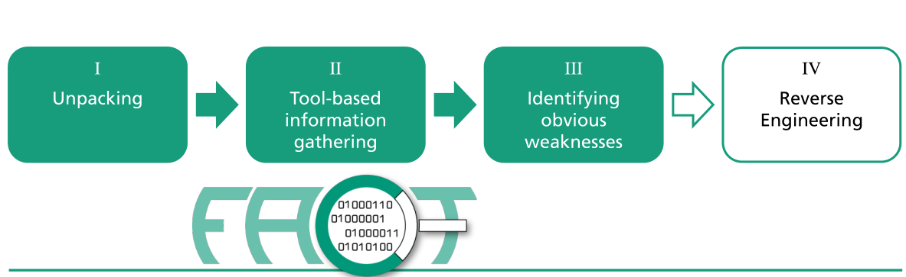
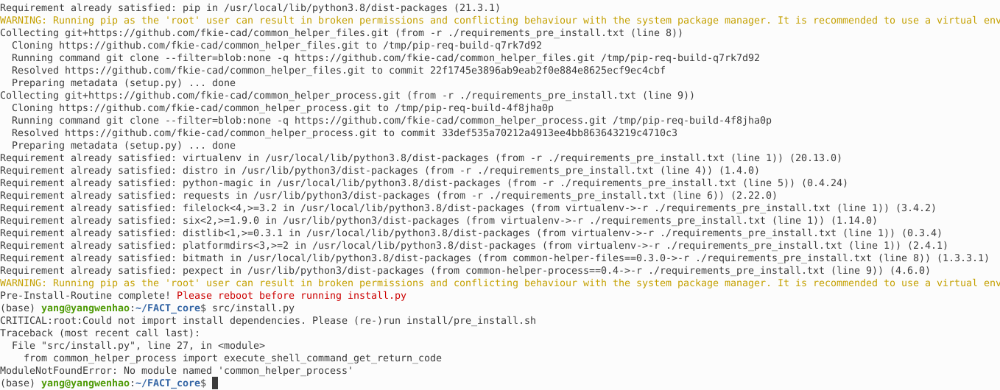
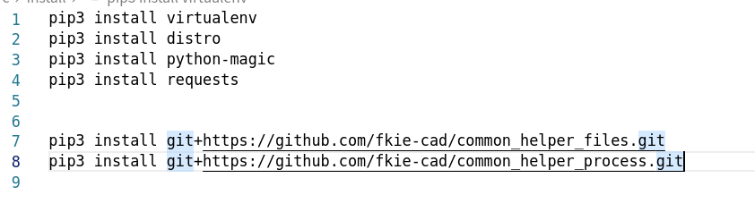

链接:

[FACT 项目主页](https://fkie-cad.github.io/FACT_core/)

[GitHub Repo](https://github.com/fkie-cad/FACT_core)

[我的fork](https://github.com/YangWenhao3906/FACT_core)

# FACT README

The Firmware Analysis and Comparison Tool (FACT)固件分析与比较工具

固件分析和比较工具(以前称为 Fraunhofer 的固件分析框架(FAF))旨在自动化大多数固件分析过程, 可以

- 解压缩任意固件文件并处理多个分析。
- 比较多个图像或单个文件。
- 分解、分析和比较基于插件，保证了最大的灵活性和可扩展性。



# 环境配置

## Pre_Install

运行

```shell
$ sudo apt update && sudo apt upgrade && sudo apt install git
$ git clone https://github.com/fkie-cad/FACT_core.git ~/FACT_core
$ ~/FACT_core/src/install/pre_install.sh && sudo mkdir /media/data && sudo chown -R $USER /media/data
```

## WSL only

要确保登录到 WSL 计算机时启动 docker

我用的并不是, Linux安装Docker后会自动运行


不更改


## Install

很疑惑,这是怎么回事

### 报错: common helper process没有找到

为什么common helper process没有找到



明明完成了安装


### 尝试: 手动安装

不懂,索性手动一条条用pip3 install



## 从头:在conda虚拟环境中配置

