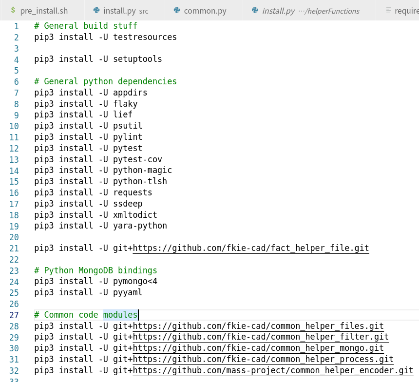

链接:

[FACT 项目主页](https://fkie-cad.github.io/FACT_core/)

[GitHub Repo](https://github.com/fkie-cad/FACT_core)

[我的fork](https://github.com/YangWenhao3906/FACT_core)

# FACT README

The Firmware Analysis and Comparison Tool (FACT)固件分析与比较工具

固件分析和比较工具(以前称为 Fraunhofer 的固件分析框架(FAF))旨在自动化大多数固件分析过程, 可以

- 解压缩任意固件文件并处理多个分析。
- 比较多个图像或单个文件。
- 分解、分析和比较基于插件，保证了最大的灵活性和可扩展性。


# 环境配置

## Pre_Install

运行

```shell
$ sudo apt update && sudo apt upgrade && sudo apt install git
$ git clone https://github.com/fkie-cad/FACT_core.git ~/FACT_core
$ ~/FACT_core/src/install/pre_install.sh && sudo mkdir /media/data && sudo chown -R $USER /media/data
```

## WSL only

要确保登录到 WSL 计算机时启动 docker

我用的并不是, Linux安装Docker后会自动运行


不更改


## Install

很疑惑,这是怎么回事

### 报错: common helper process没有找到

为什么common helper process没有找到


明明完成了安装


### 尝试: 手动安装

不懂,索性手动一条条用pip3 install


## 从头:在conda虚拟环境中配置

### 报错git clone

运行install.py后报错

```shell
(FACT) yang@yangwenhao:~/FACT_core$ src/install.py
[2022-01-23 19:37:14][install][INFO]: FACT Installer 1.2
[2022-01-23 19:37:14][common][INFO]: Updating system
[sudo] yang 的密码： 
[2022-01-23 19:37:19][install][INFO]: Installing apt-transport-https autoconf automake build-essential git libtool python3 python3-dev unzip libfuzzy-dev libmagic-dev
[2022-01-23 19:37:20][common][INFO]: Installing python3 pip
[2022-01-23 19:40:53][install][ERROR]: Pip package git+https://github.com/fkie-cad/common_helper_process.git could not be installed:
  Running command git clone -q https://github.com/fkie-cad/common_helper_process.git /tmp/pip-req-build-jg4rfgyh
  error: RPC 失败。curl 16 Error in the HTTP2 framing layer
  fatal: 远端意外挂断了
ERROR: Command errored out with exit status 128: git clone -q https://github.com/fkie-cad/common_helper_process.git /tmp/pip-req-build-jg4rfgyh Check the logs for full command output.

Traceback (most recent call last):
  File "/home/yang/FACT_core/src/install.py", line 183, in <module>
    install()
  File "/home/yang/FACT_core/src/install.py", line 151, in install
    install_fact_components(args, distribution, none_chosen, skip_docker)
  File "/home/yang/FACT_core/src/install.py", line 165, in install_fact_components
    common(distribution)
  File "/home/yang/FACT_core/src/install/common.py", line 49, in main
    install_pip_packages(PIP_DEPENDENCIES)
  File "/home/yang/FACT_core/src/helperFunctions/install.py", line 265, in install_pip_packages
    run_cmd_with_logging(command, silent=True)
  File "/home/yang/FACT_core/src/helperFunctions/install.py", line 222, in run_cmd_with_logging
    raise err
  File "/home/yang/FACT_core/src/helperFunctions/install.py", line 216, in run_cmd_with_logging
    subprocess.run(cmd_, stdout=PIPE, stderr=PIPE, encoding='UTF-8', shell=shell, check=True, **kwargs)
  File "/home/yang/anaconda3/envs/FACT/lib/python3.9/subprocess.py", line 528, in run
    raise CalledProcessError(retcode, process.args,
subprocess.CalledProcessError: Command '['sudo', '-EH', 'pip3', 'install', '-U', 'git+https://github.com/fkie-cad/common_helper_process.git', '--prefer-binary']' returned non-zero exit status 1.
```

可能是网络问题,再运行一次

### 再次运行: 报错No module named 'pip'

这次报错很奇怪: ModuleNotFoundError: No module named 'pip', 我明明有pip

```shell
(FACT) yang@yangwenhao:~/FACT_core$ src/install.py
[2022-01-23 19:45:21][install][INFO]: FACT Installer 1.2
[2022-01-23 19:45:21][common][INFO]: Updating system
[2022-01-23 19:45:24][install][INFO]: Installing apt-transport-https autoconf automake build-essential git libtool python3 python3-dev unzip libfuzzy-dev libmagic-dev
[2022-01-23 19:45:25][common][INFO]: Installing python3 pip
[2022-01-23 19:45:30][install][ERROR]: Pip package testresources could not be installed:
Traceback (most recent call last):
  File "/usr/bin/pip3", line 5, in <module>
    from pip._internal.cli.main import main
ModuleNotFoundError: No module named 'pip'

Traceback (most recent call last):
  File "/home/yang/FACT_core/src/install.py", line 183, in <module>
    install()
  File "/home/yang/FACT_core/src/install.py", line 151, in install
    install_fact_components(args, distribution, none_chosen, skip_docker)
  File "/home/yang/FACT_core/src/install.py", line 165, in install_fact_components
    common(distribution)
  File "/home/yang/FACT_core/src/install/common.py", line 49, in main
    install_pip_packages(PIP_DEPENDENCIES)
  File "/home/yang/FACT_core/src/helperFunctions/install.py", line 265, in install_pip_packages
    run_cmd_with_logging(command, silent=True)
  File "/home/yang/FACT_core/src/helperFunctions/install.py", line 222, in run_cmd_with_logging
    raise err
  File "/home/yang/FACT_core/src/helperFunctions/install.py", line 216, in run_cmd_with_logging
    subprocess.run(cmd_, stdout=PIPE, stderr=PIPE, encoding='UTF-8', shell=shell, check=True, **kwargs)
  File "/home/yang/anaconda3/envs/FACT/lib/python3.9/subprocess.py", line 528, in run
    raise CalledProcessError(retcode, process.args,
subprocess.CalledProcessError: Command '['sudo', '-EH', 'pip3', 'install', '-U', 'testresources', '--prefer-binary']' returned non-zero exit status 1.
```

### 手动安装



# FACT插件

## 如何写一个插件

对[插件模板](https://github.com/fkie-cad/FACT_analysis_plugin_template)以及插件[cve_lookup](https://github.com/fkie-cad/FACT_analysis-plugin_CVE-lookup)进行分析:

### 基本信息的填写:	


### 关键: 函数`process_object(self, file_object)`的实现

```
This function must be implemented by the plug-in.
Analysis result must be a dict stored in "file_object.processed_analysis[self.NAME]"
CAUTION: Dict keys must be strings!
If you want to propagate results to parent objects store a list of strings in
        "file_object.processed_analysis[self.NAME]['summary']".

        File's binary is available via "file_object.binary".
        File's local storage path is available via "file_object.file_path".
        Results of other plug-ins can be accessed via "file_object.processed_analysis['PLUGIN_NAME']".
        Do not forget to add these plug-ins to "DEPENDENCIES".

该函数必须由插件实现。
分析结果必须是一个字典存储在"file_object. procesed_analysis [self.NAME]"
注意:字典键必须是字符串!
如果要将结果传播到父对象，则在中存储字符串列表
“file_object.processed_analysis self.NAME(“摘要”)”。
File的二进制文件可以通过"file_object.binary"获得。
文件的本地存储路径可以通过"file_object.file_path"获得。
其他插件的结果可以通过"file_object. procesd_analysis ['PLUGIN_NAME']"来访问
```

## cve lookup插件功能的实现

### 数据库构建

查看代码`data_prep.py`

功能: 下载CPE和CVE, 进行一些处理之后, 构建table

```Python
CPE_URL = 'https://nvd.nist.gov/feeds/xml/cpe/dictionary/official-cpe-dictionary_v2.3.xml.zip'
CVE_URL = 'https://nvd.nist.gov/feeds/json/cve/1.0/nvdcve-1.0-{}.json.zip'
```

### 查询

1. 遍历所有component, 并将component split为`product`和`version`, 对每个component调用`func lookup_vulnerabilities_in_database()`,即在数据库中查找漏洞

2. 对product, 构建查询term, 首先在`CPE`中寻找, sort之后返回`matched_product`

   - 什么是CPE?

     [wiki CPE](https://en.wikipedia.org/wiki/Common_Platform_Enumeration)

   ```
   Common Platform Enumeration (CPE) is a structured naming scheme for information technology systems, software, and packages. Based upon the generic syntax for Uniform Resource Identifiers (URI), CPE includes a formal name format, a method for checking names against a system, and a description format for binding text and tests to a name.
   
   CPE是信息技术系统、软件和包的结构化命名方案。基于统一资源标识符(URI)的通用语法，CPE 包括正式名称格式、针对系统检查名称的方法以及将文本和测试绑定到名称的描述格式
   ```

   - CPE格式

   ```xml
   cpe:<cpe_version>:<part>:<vendor>:<product>:<version>:<update>:<edition>:<language>:<sw_edition>:<target_sw>:<target_hw>:<other>
   ```

   - 查询函数

   ```Python
   def match_cpe(db: DB, product_search_terms: list) -> Generator[namedtuple, None, None]:
       for vendor, product, version in db.select_query(QUERIES['cpe_lookup']):
           for product_term in product_search_terms:
               if terms_match(product_term, product):
                   yield PRODUCT(vendor, product, version)
   ```

   - 查询语句:

   ```Python
   {
       "cpe_lookup": "SELECT DISTINCT vendor, product, version FROM cpe_table",
    	"cve_lookup": "SELECT cve_id, vendor, product, version FROM cve_table",
   }
   ```

3. 在`CPE`中找到后, 接着在`CVE`中寻找, 若match, **则返回`CVE ID`的list, 存储在`cve_candidates`**

   ```Python
   def search_cve(db: DB, product: namedtuple) -> Generator[str, None, None]:
       for cve_id, vendor, product_name, version in db.select_query(QUERIES['cve_lookup']):
           if terms_match(product.vendor_name, vendor) and terms_match(product.product_name, product_name) \
                   and (product.version_number.startswith(get_version_index(version, 0)) or version == 'ANY' or version == 'NA'):
               yield cve_id
   ```
