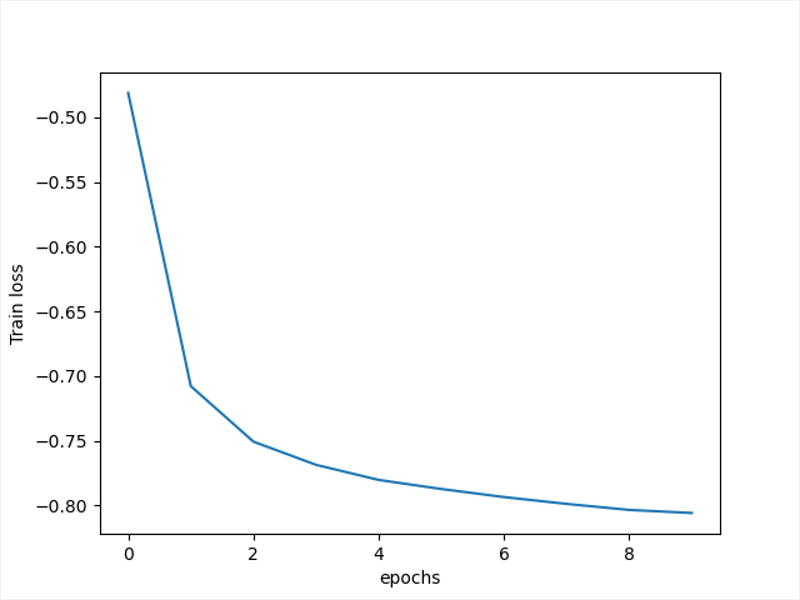

### run the baseline experiment with MNIST on MLP

运行

```Python
python src/baseline_main.py --model=mlp --dataset=mnist --gpu=cuda:0 --epochs=10
```

结果如下




### run the federated experiment with CIFAR on CNN (IID):

```Python
python src/federated_main.py --model=cnn --dataset=cifar --gpu=0 --iid=1 --epochs=10
```

Train Accuracy仅仅是40%


把epoch改成50

```Python
python src/federated_main.py --model=cnn --dataset=cifar --gpu=cuda:0 --iid=1 --epochs=50
```

好了一点


把epoch改成500


