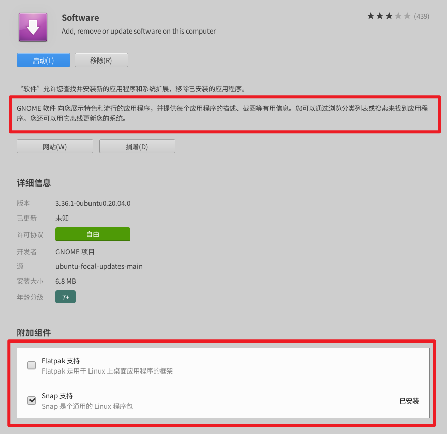
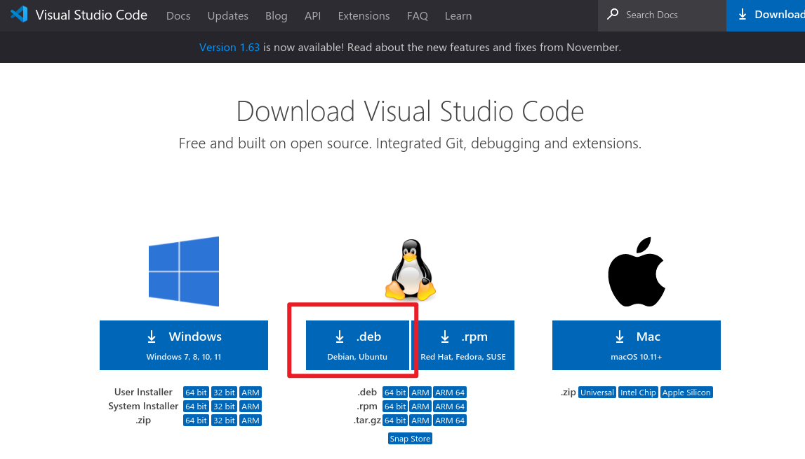

# VSCode打不开

## 原本安装方式-Ubuntu的软件商店(Gnome software)

**猜测原因**: 每个snap默认都被严格限制

**评论区有类似问题**:


什么是[GnomeSoftware](https://zh.wikipedia.org/wiki/GNOME_%E8%BB%9F%E9%AB%94)

```shell
GNOME 软件是用来Linux主机用来安装更新软件的应用程序，以C语言撰写，并于GNOME 3.10开始发行。

此应用也可用来增加或管理包库（像是Ubuntu的PPA）。Ubuntu 操作系统也于Ubuntu 16.04 LTS正式使用GNOME Software，并派生出“Ubuntu 软件”
```

什么是[snap](https://cn.ubuntu.com/blog/what-is-snap-application),对应[wiki](https://zh.wikipedia.org/wiki/Snappy_(%E5%8C%85%E7%AE%A1%E7%90%86%E5%99%A8))

```shell
如果你在使用Ubuntu 18.04/20.04 LTS版本的Ubuntu系统，会发现系统里面多了一个应用格式包——.snap包。Snap包是Ubuntu 16.04 LTS发布时引入的新应用格式包。目前已流行在Ubuntu且在其他如Debian、Arch Linux、Fedora、Kaili Linux、openSUSE、Red Hat等Linux发行版上通过snapd来安装使用snap应用。较传统Linux的rpm，deb软件包，snap有什么特点和优势呢？下面将为你介绍snap软件包。

当你在安装完snap后，你会发现在在根目录下会出现如/dev/loop0的挂载点，这些挂载点正是snap软件包的目录。Snap使用了squashFS文件系统，一种开源的压缩，只读文件系统，基于GPL协议发行。一旦snap被安装后，其就有一个只读的文件系统和一个可写入的区域。应用自身的执行文件、库、依赖包都被放在这个只读目录，意味着该目录不能被随意篡改和写入。

squashFS文件系统的引入，使得snap的安全性要优于传统的Linux软件包。同时，每个snap默认都被严格限制（confined），即限制系统权限和资源访问。但是，可通过授予权限策略来获得对系统资源的访问。这也是安全性更好的表现。
```

之前可以正常使用, 今天打不开




## 官网下载.deb并使用apt install



```shell
sudo apt install ./code_1.63.2-1639562499_amd64.deb
```

正常运行